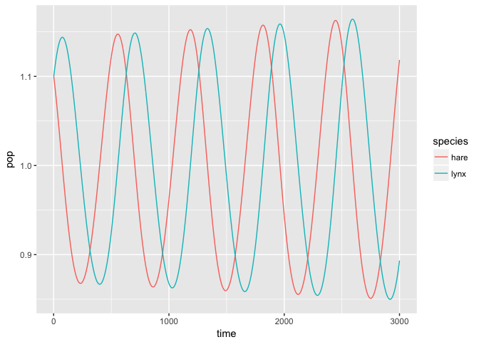

Day 1 Activity Answers
================

In our first hands-on activity we are going to ask you to import, clean, and visualize a novel data set and finally to build a simple simulation to try to reproduce the patterns obvserved.

This activity and code was adapted from Module 2 of the Fall 2017 ESPM 157 Data Science for Global Change course taught at UC Berkeley by Carl Boettiger & Dana Seidel.

For the answers, find the completed file `Day1_Activity_answers` in out github repo. 

Task 1: Import Data
===================

In this activity, we will explore population dynamics of multiple interacting species using an example of a classic data set that played a fundamental role in our early understanding of population dynamics and the mathematical field of dynamical systems more generally. This example comes from records of the Hudson Bay fur trapping company on the prevelance of Canadian Lynx and Snowshoe Hare populations.

The data for this activity is found [here](https://raw.githubusercontent.com/bblais/Systems-Modeling-Spring-2015-Notebooks/master/data/Lynx%20and%20Hare%20Data/lynxhare.csv). Using the proper `readr` command, read in this dataset, preserving only the columns "year", "hare",. and "lynx".

``` r
data <- read_delim("https://raw.githubusercontent.com/bblais/Systems-Modeling-Spring-2015-Notebooks/master/data/Lynx%20and%20Hare%20Data/lynxhare.csv",
                ";") 
```

    ## Warning: Missing column names filled in: 'X6' [6], 'X7' [7], 'X8' [8],
    ## 'X9' [9], 'X10' [10], 'X11' [11], 'X12' [12], 'X13' [13], 'X14' [14],
    ## 'X15' [15], 'X16' [16], 'X17' [17]

    ## Parsed with column specification:
    ## cols(
    ##   year = col_integer(),
    ##   hare = col_integer(),
    ##   lynx = col_integer(),
    ##   nao = col_double(),
    ##   `soi (MONTHLY)` = col_double(),
    ##   X6 = col_double(),
    ##   X7 = col_double(),
    ##   X8 = col_double(),
    ##   X9 = col_double(),
    ##   X10 = col_double(),
    ##   X11 = col_double(),
    ##   X12 = col_double(),
    ##   X13 = col_double(),
    ##   X14 = col_double(),
    ##   X15 = col_double(),
    ##   X16 = col_double(),
    ##   X17 = col_character()
    ## )

``` r
# or 
# data <- read_csv("https://github.com/dpseidel/MovEco-R-Workshop/raw/master/Materials/Day1/lynx_hare.csv")
```

Explore your newly imported data using the `summary` command and evaluate its first lines using the `head` command. Be sure that the data looks clean and properly formatted and then answer the following questions.

#### Some Questions:

-   What years does this dataset cover?
-   Does our dataset contain missing values?

Task 2: Clean & manipulate the data
===================================

Let's try cleaning up this dataset a bit.

Filter only the years that have data for both hare and lynx.

``` r
data %>%
  select(year, hare, lynx) %>%
  filter(!is.na(hare), !is.na(lynx))
```

    ## # A tibble: 49 x 3
    ##     year  hare  lynx
    ##    <int> <int> <int>
    ##  1  1852 80000  2174
    ##  2  1853 80000  2106
    ##  3  1854 90000  3021
    ##  4  1855 69000  4754
    ##  5  1856 81000  7324
    ##  6  1857 95000  8197
    ##  7  1858 71000  6913
    ##  8  1859 28000  4772
    ##  9  1860 18000  2383
    ## 10  1861 19000  1540
    ## # ... with 39 more rows

The scales of the populations are very different - a log scale may make these easier to compare. Mutate two new columns and take the log of the original hare and lynx columns.

``` r
data %>%
  select(year, hare, lynx) %>%
  filter(!is.na(hare), !is.na(lynx)) %>% 
  mutate(hare = log(hare), lynx = log(lynx))
```

    ## # A tibble: 49 x 3
    ##     year  hare  lynx
    ##    <int> <dbl> <dbl>
    ##  1  1852 11.3   7.68
    ##  2  1853 11.3   7.65
    ##  3  1854 11.4   8.01
    ##  4  1855 11.1   8.47
    ##  5  1856 11.3   8.90
    ##  6  1857 11.5   9.01
    ##  7  1858 11.2   8.84
    ##  8  1859 10.2   8.47
    ##  9  1860  9.80  7.78
    ## 10  1861  9.85  7.34
    ## # ... with 39 more rows

Task 3: Visualize
=================

Now, plot your new columns using `ggplot2`. Hint: the `select` and `gather` commands make multi-series plotting easier.

``` r
data %>%
  select(year, hare, lynx) %>%
  filter(!is.na(hare), !is.na(lynx)) %>% 
  mutate(hare = log(hare), lynx = log(lynx)) %>%
  gather(species, population, -year) %>%
  ggplot(aes(year, population, col=species)) + 
  geom_line()
```


Task 4: A Simulation Teaser
===========================

A combination of the ideas introduced today form the basis of all simulations. Although we will go into simulation construction in much more depth later in the workshop, just to see how all these parts fit together, let's now try your hand at a very basic simulation of lynx and hare populations,

Step 1: Defining the model
--------------------------

Let's say we want to simulate the growth of the classic lynx and hare populations through time. First, we need to construct our underlying growth equations using custom R functions:

For our simple purposes we'll ignore elements like search time and carrying capacity and define prey (H) and predator (P) growth as follows:

*f*(*H*, *P*)=*a* − *b**P*

*g*(*H*, *P*)=*c**H* − *d*

### Task 4.1: translate into custom R functions named `prey` and `pred`:

``` r
prey <- function(H, P, pars){
 (pars$a - pars$b*P)
}
pred <- function(H, P, pars){
  (pars$c*H - pars$d)
}
```

Step 2: Initialize
------------------

Before we can simulate our populations through time we have to establish some starting values for our parameters: a,b,c,d, H0 (initial prey population), and P0 (intial predator population).

Use the following parameters to get started:

    a = 0.01
    b = 0.01
    c = 0.01
    d = 0.01

use initial value *H*<sub>0</sub> = 1.1 and *P*<sub>0</sub> = 1.1 and a max time of 500 iterations to get started.

### Task 4.2: Try putting your intial values into a named list to make it easy to keep track of them:

``` r
pars <- list(a = .01, b = .01, c = .01, d = .01)
```

Step 3: Simulate
----------------

Now to simulate population levels through time, we need to loop over equations that take the value of a given population at time t and add it to the change in the population over a given time step, e.g.:

*H*<sub>*t* + 1</sub> = *H*<sub>*t*</sub> + *H*<sub>*t*</sub>*f*(*H*, *P*)

*P*<sub>*t* + 1</sub> = *P*<sub>*t*</sub> + *P*<sub>*t*</sub>*g*(*H*, *P*)

A basic simulation is just a complex custom function containing 3 steps. Below I've included some starter code to help you better understand the 3 required steps:

1.  initialize: initialize your vectors so that the for loop knows where to start and has place to store output.

<!-- -->

    # something like: 
      H <- numeric(t)  # makes a blank vector of length t
      P <- numeric(t)
      H[1] <- H0  # places our initial population values
      P[1] <- P0

1.  iterate: run your loop!

<!-- -->

    # we're looking for a loop like this
     for(i in 1:(t-1)){
          H[i+1] <- (1 + prey(H[i], P[i], pars)) * H[i] # note this is just the r code for the population equations above
          P[i+1] <- (1 + pred(H[i], P[i], pars)) * P[i] # see how I included our custom growth equation from step 1?
      }

1.  output: return your results!

<!-- -->

    # we will want a dataframe with our simulated H and P values, and an id for each iteration or timestep
    data.frame(time = 1:t, hare = H, lynx = P)

Just like our custom functions from step 1, this simulation needs to take several arguments namely:

-   the number of iterations we want to run for
-   all necessary parameters and initial values for our models
-   our predator growth function
-   our prey growth function

### Task 4.3: Try putting together your simulation in a custom function

Try taking the above arguments and looping over the discrete equations listed above. Your simulation function should include each of the 3 steps: initialize, iterate, and output.

``` r
sim <- function(pars = list(a = .01, b = .01, c = .01, d = .01),
                H0 = 1.1, P0 = 1.1, time = 500, g = pred, f = prey){
  H <- numeric(time) 
  P <- numeric(time)
  H[1] <- H0
  P[1] <- P0
  for(i in 1:(time-1)){
      H[i+1] <- max((1 + f(H[i], P[i], pars)) * H[i], 0)
      P[i+1] <- max((1 + g(H[i], P[i], pars)) * P[i], 0)
  }
  data.frame(time = 1:time, hare = H, lynx = P)
}

firstsim <- sim()
head(firstsim, 10)
```

    ##    time     hare     lynx
    ## 1     1 1.100000 1.100000
    ## 2     2 1.098900 1.101100
    ## 3     3 1.097789 1.102189
    ## 4     4 1.096667 1.103267
    ## 5     5 1.095535 1.104333
    ## 6     6 1.094392 1.105388
    ## 7     7 1.093238 1.106432
    ## 8     8 1.092075 1.107463
    ## 9     9 1.090901 1.108483
    ## 10   10 1.089718 1.109491

### Task 4.4: Visualize your simulated data

Create a plot showing your simulated population sizes of hare (x) and lynx (y) over time.

``` r
sim() %>%
  gather(species, pop, -time) %>% 
  ggplot(aes(time, pop, col=species)) +
  geom_line()
```


Use `geom_path` to create a phase plane diagram i.e, a plot of hare size vs linx size with various starting conditions.

``` r
sim(time = 9000) %>%
  ggplot(aes(lynx, hare)) +
  geom_path()
```


### Task 4.5: Adapt your simulation

Try playing with your intial values or adapting your inital equations to include carrying capacity or search time for more biologically realistic results.

Now that you have the basic structure of your simulation down, try playing with it to learn about the senstivity and role of each of your parameters. Some ideas:

1.  Increase the time interval to 1000, 3000, 9000. Plot. What happens?

``` r
sim2 <- sim(time = 1000)
sim2 %>% 
  gather(species, pop, -time) %>% 
  ggplot(aes(time, pop, col=species)) +
  geom_line()
```


``` r
sim3 <- sim(time = 3000)
sim3 %>% 
  gather(species, pop, -time) %>% 
  ggplot(aes(time, pop, col=species)) +
  geom_line()
```



``` r
sim4 <- sim(time = 9000)
sim4 %>% 
  gather(species, pop, -time) %>% 
  ggplot(aes(time, pop, col=species)) +
  geom_line()
```


1.  Vary the starting conditions. Plot. What do you see?

``` r
sim6 <- sim(pars=list(a = .02, b = .03, c=.05, d=.04), H0=2, P0=2, time=1000)
sim6 %>% 
  gather(species, pop, -time) %>% 
  ggplot(aes(time, pop, col=species)) +
  geom_line()
```


1.  Re-define the function for hare population, `f(x,y)`, to reflect limits on growth due to a carrying capacity:
    *f*(*x*, *y*)=*a*(1 − *H*/*K*)−*b**P*
     Adapt and rerun your simulation. For starters, use `K = 10` and the same initial conditions as before (`H0 = 1.1`, `P0 = 1.1`). Plot the results. How have things changed? Can you obtain stable long-term behavior? What behavior do you see? Can you obtain stable long-term cycles? If so, how? If not, then why do you think that is?

``` r
prey_DD <- function(H, P, pars){
  pars$a*(1-H/pars$K) - pars$b*P
}

simDD <- sim(pars = list(a=.01, b=.01, c=.01, d=.01, K=10), f = prey_DD, time=10000)
simDD %>% 
  gather(species, pop, -time) %>% 
  ggplot(aes(time, pop, col=species)) +
  geom_line()
```


``` r
simDD %>%
  ggplot(aes(hare, lynx)) +
  geom_path()
```


1.  Introduce a saturating function into your functions for hare and lynx populations to reflect the search and handling time that limit the number of prey lynx can take in a given time step. Including this "saturating" function
    $$h(H) = \\frac{1}{1 + s \\cdot H}$$
    , your equations for prey and predator become:
    *f*(*H*, *P*)=*a*(1 − *H*/*K*)−*b* ⋅ *P* ⋅ *h*(*H*)
    *g*(*H*, *P*)=*c* ⋅ *H* ⋅ *h*(*H*)−*d*

Note that *h*(*x*) is called a *functional response*, or handling time. Write this out as a new custom r fucntion. Adapt and rerun your simulation. For starters, use `s = 1/5`. Plot the results. How have things changed? Can you obtain stable long-term behavior? What behavior do you see? Can you obtain stable long-term cycles now?

``` r
h <- function(H, s){
  1 / (1 + s*H)
}

prey3 <- function(H, P, pars){
  pars$a * (1 - H / pars$k) -  pars$b * P * h(H, pars$s)
}

pred3 <- function(H, P, pars){
  pars$c*H*h(H, pars$s) - pars$d
}

sim7 <- sim(f = prey3, g = pred3, time = 12000, H0=2, P0=2,
            pars=list(a=.01, b=.01, c=.01, d=.01, k=10, s=.2))
sim7 %>%
  ggplot(aes(hare, lynx)) +
  geom_path()
```


``` r
sim7 %>%
  gather(species, pop, -time) %>% 
  ggplot(aes(time, pop, col=species)) +
  geom_line()
```


That's it for today - much more practice with data and simulations in the coming days!
