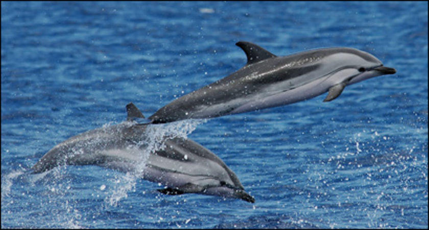
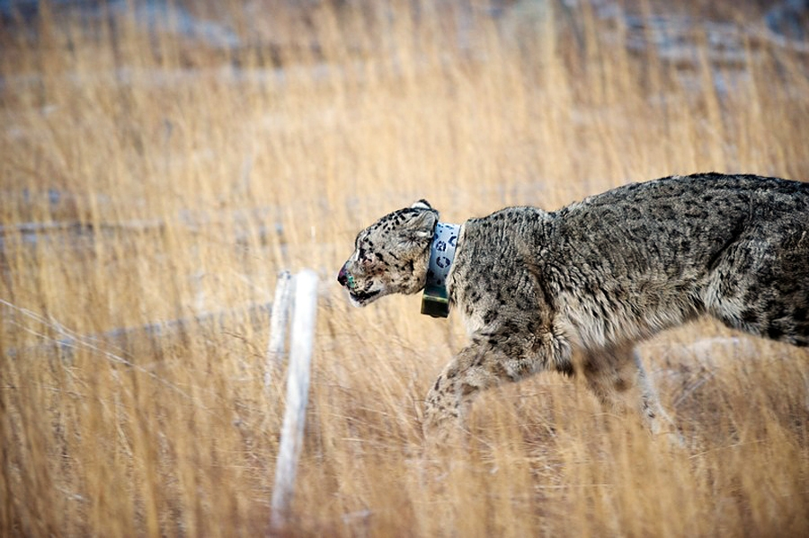

```{r include=FALSE}
library("tidyverse")
library("printr") ## devtools::install_github("yihui/printr")
knitr::opts_chunk$set(comment=NA, message=FALSE, dev="svg", fig.height = 4, fig.width = 7)

```

# Introduction & Goals

##


# { .cover }


# { .cover }


# { .cover }


<!-- Lesson Overview -->

## Computational Topics

> - Reading in data from the web into the R / RStudio environment
> - Become familiar with variations in CSV / tabular data formats and how to handle them
> - Working with dates and date-time objects
> - Plotting timeseries data
> - Subsetting, reshaping data
> - `apply` functions

-------------------------------
