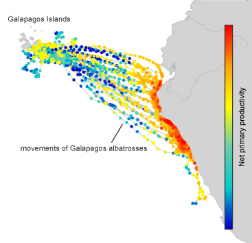

```{r setup, include=FALSE}
knitr::opts_chunk$set(echo = TRUE)
```

## Movebank
As we mentioned in our morning lecture, movement data can come in a variety of forms
and resolutions and the tools to  analyse them have exploded in recent years.
Though often researchers in your position
will have data of your own, collected via GPS recievers, there has been an effort 
to share movement data from other collections through the Movebank database. Movebank 
is a free online infrastructure created to help researchers manage, share, analyze, 
and archive animal movement data. `move` an R package that contains functions to
access movement data stored in [movebank.org](http://www.movebank.org) as well
as tools to visualize and statistically analyze animal movement data. 
`move` is addressing movement ecology questions that complement existing efforts 
such as `adeHabitat` and other packages which we will introduce later.

Consider Albatross data, study id: 2911040
```{r}
library(move)
loginStored <- movebankLogin(username="YOURUSERNAME", password="YOURPASSWORD")
albatross <- getMovebank("event", study_id = 2911040, login=loginStored)
```

As an sf object:
```{r}
albatross_sf <- 
  albatross %>%
  na.omit() %>%
  st_as_sf(coords = c("location_long", "location_lat"), crs=4326)
```

Look at how many records we have per individual:
```{r}
albatross_sf %>% 
  group_by(individual_id) %>% 
  tally()
```

Map the paths of a couple:
```{r}
albatross_sf %>% 
  filter(individual_id %in% c(2911059,2911062)) %>% 
  mapview(zcol="individual_id")
```

# Potential tasks 
- Look at env var layers from <https://www.movebank.org/node/7471> and 
plot albatross tracks with attributes, e.g. Ocean productivity

