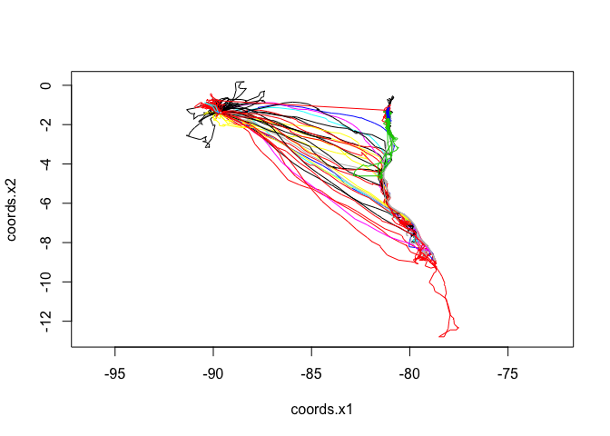
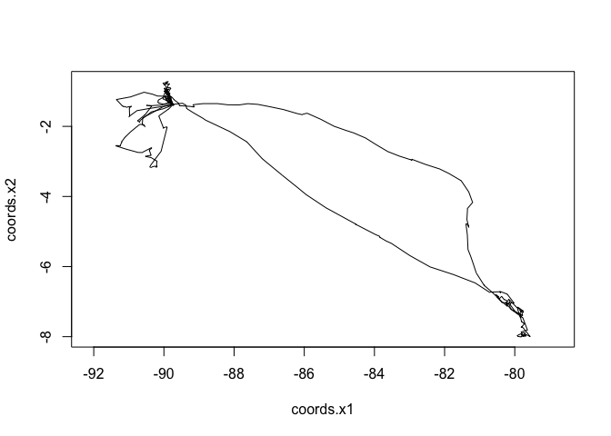
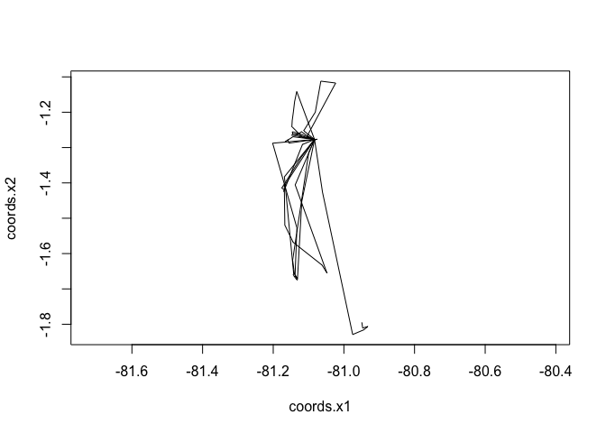
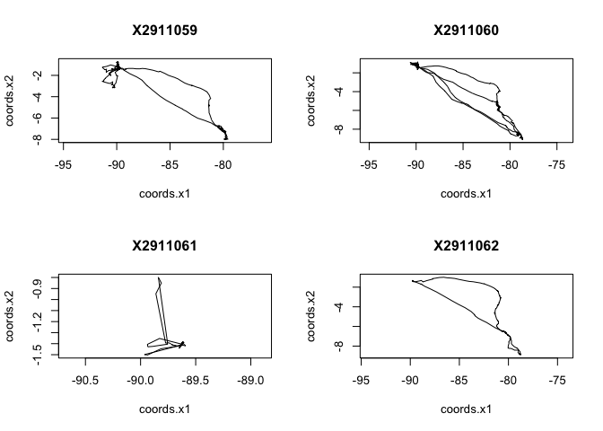
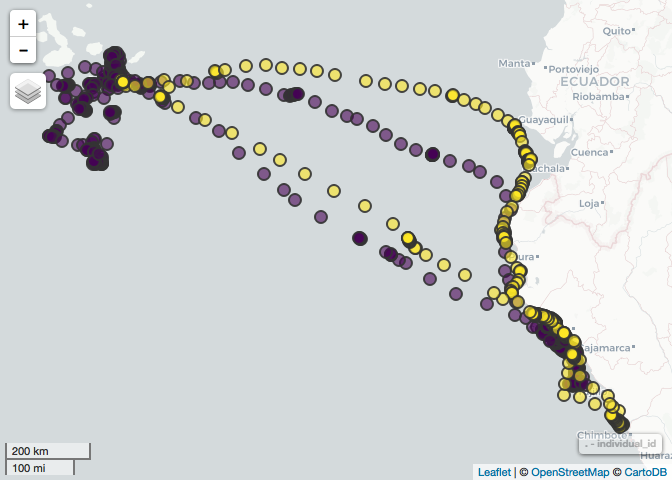
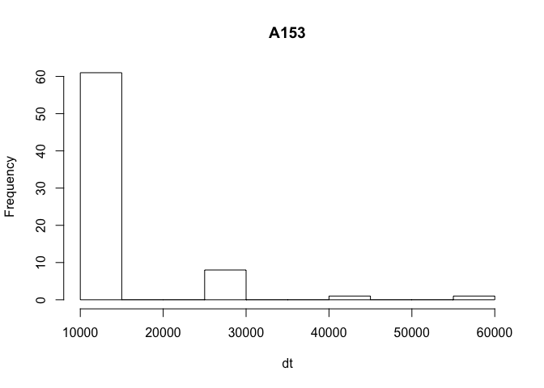
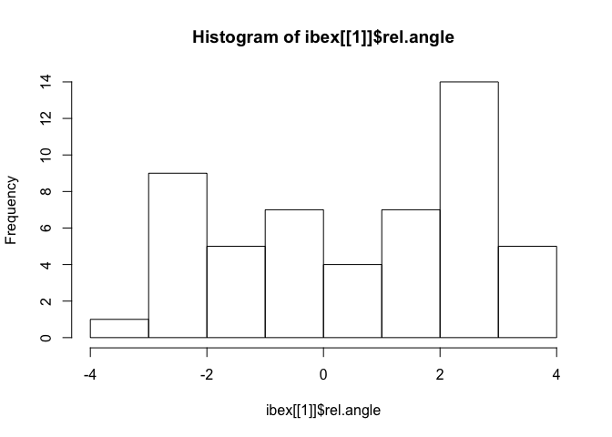
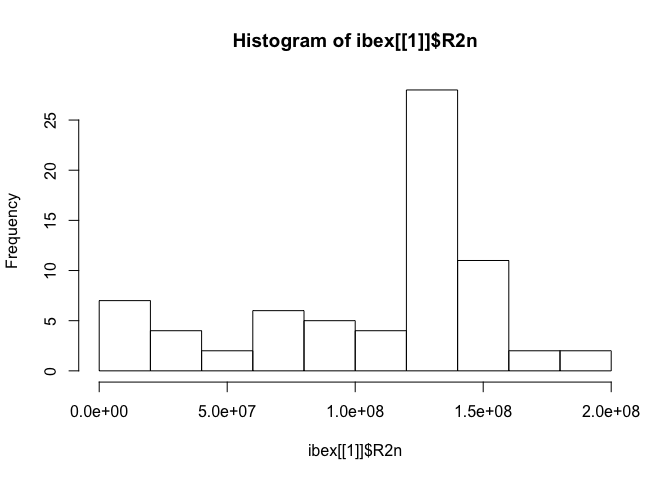
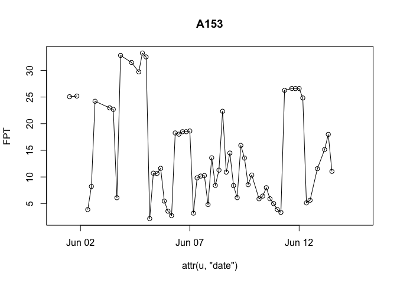
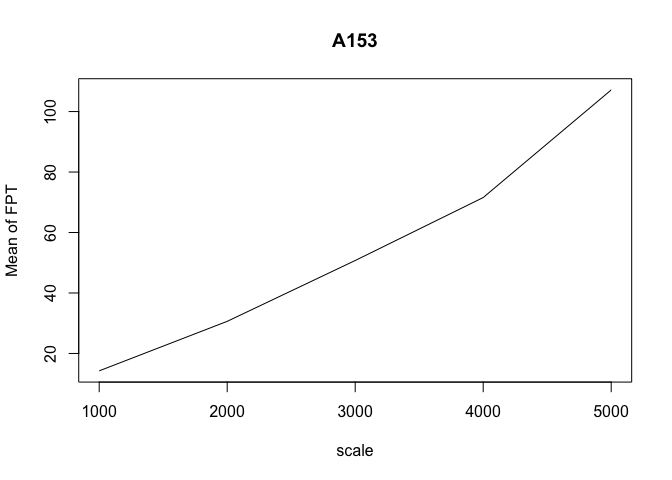

Exploring Movement Data in R
================
Dana Seidel & Eric Dougherty
January 4, 2018

``` r
library(tidyverse)
```

    ## ── Attaching packages ───────────────────────────────────────────────────────────────────────────────────── tidyverse 1.2.1 ──

    ## ✔ ggplot2 2.2.1.9000     ✔ purrr   0.2.4     
    ## ✔ tibble  1.3.4          ✔ dplyr   0.7.4     
    ## ✔ tidyr   0.7.2          ✔ stringr 1.2.0     
    ## ✔ readr   1.1.1          ✔ forcats 0.2.0

    ## ── Conflicts ──────────────────────────────────────────────────────────────────────────────────────── tidyverse_conflicts() ──
    ## ✖ dplyr::filter() masks stats::filter()
    ## ✖ dplyr::lag()    masks stats::lag()

``` r
library(sf)
```

    ## Linking to GEOS 3.6.2, GDAL 2.2.3, proj.4 4.9.3

``` r
library(mapview)
```

    ## Loading required package: leaflet

``` r
library(move)
```

    ## Loading required package: geosphere

    ## Loading required package: sp

    ## Loading required package: raster

    ## 
    ## Attaching package: 'raster'

    ## The following object is masked from 'package:dplyr':
    ## 
    ##     select

    ## The following object is masked from 'package:tidyr':
    ## 
    ##     extract

    ## The following object is masked from 'package:ggplot2':
    ## 
    ##     calc

    ## Loading required package: rgdal

    ## rgdal: version: 1.2-16, (SVN revision 701)
    ##  Geospatial Data Abstraction Library extensions to R successfully loaded
    ##  Loaded GDAL runtime: GDAL 2.1.3, released 2017/20/01
    ##  Path to GDAL shared files: /Library/Frameworks/R.framework/Versions/3.4/Resources/library/rgdal/gdal
    ##  GDAL binary built with GEOS: FALSE 
    ##  Loaded PROJ.4 runtime: Rel. 4.9.3, 15 August 2016, [PJ_VERSION: 493]
    ##  Path to PROJ.4 shared files: /Library/Frameworks/R.framework/Versions/3.4/Resources/library/rgdal/proj
    ##  Linking to sp version: 1.2-5

``` r
library(adehabitatLT)
```

    ## Loading required package: ade4

    ## Loading required package: adehabitatMA

    ## 
    ## Attaching package: 'adehabitatMA'

    ## The following object is masked from 'package:raster':
    ## 
    ##     buffer

    ## Loading required package: CircStats

    ## Loading required package: MASS

    ## 
    ## Attaching package: 'MASS'

    ## The following objects are masked from 'package:raster':
    ## 
    ##     area, select

    ## The following object is masked from 'package:dplyr':
    ## 
    ##     select

    ## Loading required package: boot

    ## 
    ## Attaching package: 'adehabitatLT'

    ## The following object is masked from 'package:move':
    ## 
    ##     burst

    ## The following object is masked from 'package:dplyr':
    ## 
    ##     id

Movement data
=============

As mentioned this morning, movement data may come in a variety of scales and resolutions, requiring careful consideration before analysis.

Here we are going to focus on GPS relocation data as it is one of the most common forms of tracking data and provides a (mostly) consistent record of an animals movement path.

Justr as there are multiple semi-cooperative packages in R for working with spatial data generaly, there are many packages in R used to handle movement data, and an ever growing number built for specific analyses. Unfortunately there is no strict consensus yet on which class movement data objects should be in across packages, and researchers often have to be comfortable converting from one to the other depending on the task at hand and the format required by each package. Although there are most definitely more R packages created for dealing with animal movement data, we are going to focus today on the two most prominent `move` and `adehabitatLT`.

To begin we are going to introduce Movebank and `Move` & `MoveStack` objects with the library `move`. Later we will introduce the `adehabitatLT` package and demonstrate how easy it is to pull out primary stepwise characteristics like step length, turning angle, and net displacement from our trajectories. These primary path characteristics will form the basis for many more complex movement analyses including our simulations later next week.

Movebank
--------

Though often researchers in your position will have data of your own, there has been an effort to share movement data from other collections through the Movebank database. Movebank is a free online infrastructure created to help researchers manage, share, analyze, and archive animal movement data. `move` is an R package that contains functions to access movement data stored in [movebank.org](http://www.movebank.org) as well as tools to visualize and statistically analyze animal movement data. `move` is addressing movement ecology questions that complement existing efforts such as `adeHabitat` and other packages which we will introduce later.

There are 3 ways to load movement data into R as a `move` object: 1. Using the movebank API 2. Directly loading movebank-formatted .csvs 3. Converting data from a traditional dataframe

Here let's consider some Albatross data, from movebank study \#2911040: To load data directly from the movebank API like I will here, you would need your own movebank username and password, here I have stored my password in my local environment as the variable `pass`.

``` r
loginStored <- movebankLogin(username="dpseidel", password=pass)

#search for studies - 
searchMovebankStudies(x="albatross", login=loginStored)
#get study ID - 
getMovebankStudy(2911040, login=loginStored)$citation

#check for animal IDs - 
getMovebankAnimals(2911040, login=loginStored)
#get the all data - getMovebankData()
#get only specific animal by specifying individual_id

albatross <- getMovebank("event", study_id = 2911040, login=loginStored)

write_tsv(albatross, "Study2911040")
# getMovebank("event", login, study_id,...): returns the sensor measurements from a study. 
# See also getMovebankData, getMovebankNonLocationData.
```

To save us the effort of getting you all Movebank logins at this point, I have provided the tsv. We can use this to demonstrate the 3rd way of loading in movement data.

``` r
study <- read_tsv("data_files/Study2911040", comment="##",
                  col_types = "Tnncc")
study <- as.data.frame(study)
                       
albatross <- move(x=study$location_long,
              y=study$location_lat,
              time=study$timestamp,
              data=study,
              animal = as.factor(study$individual_id),
              sensor = as.factor(study$tag_id),
              proj=CRS("+proj=longlat"))
```

    ## Warning in .local(x, y, time, data, proj, ...): There were NA locations
    ## detected and omitted. Currently they are not stored in unusedrecords

``` r
head(albatross)
```

    ##             timestamp location_lat location_long
    ## 1 2008-05-31 13:30:02    -1.372641     -89.74021
    ## 2 2008-05-31 15:00:44    -1.372894     -89.74015
    ## 3 2008-05-31 16:30:39    -1.372881     -89.74014
    ## 4 2008-05-31 18:00:49    -1.372891     -89.74016
    ## 5 2008-05-31 19:30:18    -1.372912     -89.74013
    ## 6 2008-05-31 21:00:20    -1.372904     -89.74017

``` r
class(albatross)
```

    ## [1] "MoveStack"
    ## attr(,"package")
    ## [1] "move"

We've created our own MoveStack. We can plot it using the move::plot command and if we wish, `mapview()` which converts it to a `sf` object on the fly.

``` r
plot(albatross, type="l") # all of them
```



If we are curious to compare behaviors across individuals, we can split the moveStack, into separte move objects with the command `split`

``` r
ids <- split(albatross)
```

This allows us to plot and manipulate the individuals separately:

``` r
plot(ids[[1]], type='l')
```



``` r
plot(ids[[28]], type='l')
```



``` r
par(mfrow=c(2,2))
plot(ids[[1]], type='l', main= names(ids[1]))
plot(ids[[2]], type='l', main= names(ids[2]))
plot(ids[[3]], type='l', main= names(ids[3]))
plot(ids[[4]], type='l', main= names(ids[4]))
```



``` r
par(mfrow=c(1,1))
```

And of course, just as before, we can manipulate, and clean up, this data easily when converted to an sf object:

``` r
albatross_sf <- 
  study %>% na.omit() %>%
  st_as_sf(coords = c("location_long", "location_lat"), crs=4326)
```

For instance, in this state, it's simple to look at how many records we have per individual:

``` r
albatross_sf %>% 
  group_by(individual_id) %>% 
  tally()
```

    ## Simple feature collection with 28 features and 2 fields
    ## geometry type:  MULTIPOINT
    ## dimension:      XY
    ## bbox:           xmin: -91.3732 ymin: -12.79464 xmax: -77.51874 ymax: 0.1821983
    ## epsg (SRID):    4326
    ## proj4string:    +proj=longlat +datum=WGS84 +no_defs
    ## # A tibble: 28 x 3
    ##    individual_id     n          geometry
    ##           <fctr> <int>  <simple_feature>
    ##  1       2911059   757 <MULTIPOINT (...>
    ##  2       2911060  1113 <MULTIPOINT (...>
    ##  3       2911061   182 <MULTIPOINT (...>
    ##  4       2911062   573 <MULTIPOINT (...>
    ##  5       2911063   757 <MULTIPOINT (...>
    ##  6       2911064   633 <MULTIPOINT (...>
    ##  7       2911065   977 <MULTIPOINT (...>
    ##  8       2911066   647 <MULTIPOINT (...>
    ##  9       2911067  1503 <MULTIPOINT (...>
    ## 10       2911074  1326 <MULTIPOINT (...>
    ## # ... with 18 more rows

``` r
# something we could do on the movestack by calling...
table(albatross@trackId)
```

    ## 
    ## X2911059 X2911060 X2911061 X2911062 X2911063 X2911064 X2911065 X2911066 
    ##      757     1113      182      573      757      633      977      647 
    ## X2911067 X2911074 X2911075 X2911076 X2911077 X2911078 X2911079 X2911080 
    ##     1503     1326       32       53      189       46       67       48 
    ## X2911084 X2911085 X2911086 X2911087 X2911088 X2911089 X2911090 X2911091 
    ##       22      243      140       96       58        4      150     1338 
    ## X2911092 X2911093 X2911094 X2911095 
    ##      974     1552     2339      209

Or map the paths of a particular pair:

``` r
albatross_sf %>% 
  filter(individual_id %in% c(2911059,2911062)) %>% 
  mapview(zcol="individual_id")
```



and easily convert it back to a `movestack` as needed.

``` r
as(albatross_sf, 'Spatial') %>% as(., "MoveStack") 
```

    ## class       : MoveStack 
    ## features    : 16028 
    ## extent      : -91.3732, -77.51874, -12.79464, 0.1821983  (xmin, xmax, ymin, ymax)
    ## coord. ref. : +proj=longlat +datum=WGS84 +no_defs +ellps=WGS84 +towgs84=0,0,0 
    ## variables   : 3
    ## names       :           timestamp, individual_id,  tag_id 
    ## min values  : 2008-05-31 13:29:31,       2911059, 2911107 
    ## max values  : 2008-11-06 18:00:55,       2911095, 2911134 
    ## timestamps  : NA ... NA Time difference of NA secs  (start ... end, duration) 
    ## sensors     :  
    ## indiv. data :  
    ## individuals : NA 
    ## date created: 2017-11-07 22:24:21

There is lots more the `move` package has to offer but for now, we are going to move onto ltraj objects and the primary path characteristics they make so easy to extract. We will come back to the `move` package tomorrow when we discuss methods for estimating home ranges.

Ltraj objects
-------------

The class ltraj is intended to store trajectories of animals. `ltraj` objects function neatly as lists, similar in some ways to the list of Move objects that was created when we split out albatross MoveStack. A key difference between Move and ltraj objects is not only in the structure of data but also the attributes calculated. Ltraj ojects automatically calculate common path characteristics like step length, relative turning angle, absolute turning angle, and net squared displacement from which much of subsequent movement modelling builds off of. Additionally from these primary path characteristics it's simple to calculate secondary statistics like sinuosity, residence time, or directional persistence.

`ltrajs` can be created from a traditional data frames, spatial dataframes, or directly from move objects using the command `as.ltraj` and, in the case of the dataframes, specifying the coordinates.

``` r
# from move object
alba_ltraj  <- as(albatross, 'ltraj')
```

    ## Warning in asMethod(object): Converting a long lat projected object while
    ## the ltraj does not deal with long lat projected data

``` r
alba_ltraj  
```

    ## 
    ## *********** List of class ltraj ***********
    ## 
    ## Type of the traject: Type II (time recorded)
    ## * Time zone unspecified: dates printed in user time zone *
    ## Irregular traject. Variable time lag between two locs
    ## 
    ## Characteristics of the bursts:
    ##          id    burst nb.reloc NAs          date.begin            date.end
    ## 1  X2911059 X2911059      757   0 2008-05-31 13:30:02 2008-07-17 21:00:44
    ## 2  X2911060 X2911060     1113   0 2008-05-31 14:59:31 2008-08-09 18:00:18
    ## 3  X2911061 X2911061      182   0 2008-06-23 17:58:02 2008-07-11 10:32:29
    ## 4  X2911062 X2911062      573   0 2008-05-31 13:29:55 2008-07-06 12:00:26
    ## 5  X2911063 X2911063      757   0 2008-05-31 14:59:30 2008-07-17 22:31:01
    ## 6  X2911064 X2911064      633   0 2008-05-31 14:59:55 2008-07-11 12:00:43
    ## 7  X2911065 X2911065      977   0 2008-05-31 13:29:31 2008-08-03 10:30:44
    ## 8  X2911066 X2911066      647   0 2008-06-23 19:28:30 2008-08-03 10:30:43
    ## 9  X2911067 X2911067     1503   0 2008-06-23 17:58:01 2008-09-28 13:31:13
    ## 10 X2911074 X2911074     1326   0 2008-06-23 17:58:44 2008-09-15 13:30:17
    ## 11 X2911075 X2911075       32   0 2008-06-23 17:57:56 2008-06-25 15:00:14
    ## 12 X2911076 X2911076       53   0 2008-06-23 16:27:20 2008-06-26 21:00:31
    ## 13 X2911077 X2911077      189   0 2008-06-23 19:28:50 2008-07-05 12:00:47
    ## 14 X2911078 X2911078       46   0 2008-06-23 16:28:30 2008-06-26 12:00:55
    ## 15 X2911079 X2911079       67   0 2008-06-23 17:58:19 2008-06-27 19:30:44
    ## 16 X2911080 X2911080       48   0 2008-06-23 16:28:31 2008-06-26 13:30:43
    ## 17 X2911084 X2911084       22   0 2008-05-31 16:29:31 2008-06-01 22:30:50
    ## 18 X2911085 X2911085      243   0 2008-05-31 16:29:31 2008-06-15 22:30:55
    ## 19 X2911086 X2911086      140   0 2008-05-31 16:29:56 2008-06-09 12:00:50
    ## 20 X2911087 X2911087       96   0 2008-05-31 16:30:27 2008-06-06 15:00:22
    ## 21 X2911088 X2911088       58   0 2008-05-31 18:00:01 2008-06-04 10:30:49
    ## 22 X2911089 X2911089        4   0 2008-05-31 13:29:55 2008-05-31 16:30:55
    ## 23 X2911090 X2911090      150   0 2008-06-11 11:59:02 2008-06-20 18:00:59
    ## 24 X2911091 X2911091     1338   0 2008-07-10 23:57:31 2008-10-03 15:00:56
    ## 25 X2911092 X2911092      974   0 2008-07-10 22:28:00 2008-09-09 22:30:57
    ## 26 X2911093 X2911093     1552   0 2008-06-19 02:58:55 2008-10-13 12:00:56
    ## 27 X2911094 X2911094     2339   0 2008-06-12 13:28:49 2008-11-06 18:00:55
    ## 28 X2911095 X2911095      209   0 2008-07-11 16:27:25 2008-07-24 21:01:28
    ## 
    ## 
    ##  infolocs provided. The following variables are available:
    ## [1] "sensor"        "timestamp"     "location_lat"  "location_long"

Note all the information the this class gives us up front. Not only can we see the number of relocations from each of our animals we can see exactly the duration of each "burst" and that this is an "irregular" "Type2" trajectory. Just what exactly does that mean?

### Side note: types of trajectory

The adehabitat packages, and ltraj objects, distinguish between 2 types of trajectories: 1. Trajectories of type I are characterized by the fact that the time is not precisely known or not taken into account for the relocations of the trajectory (i.e. sampling of tracks in snow) 2. Trajectories of type II are characterized by the fact that the time is known for each relocation. This type of trajectory is in turn be divided into two subtypes: – regular trajectories: these trajectories are characterized by a constant time lag between successive relocations; – irregular trajectories: these trajectories are characterized by a variable time lag between successive relocations

It's worth emphasizing that functions in `adehabitatLT` are mainly designed to deal with type I or type II regular trajectories. Irregular trajectories are harder to analyze as their descriptive parameters may not be compared when computed on different time lags.

### Side note: Making an irregular trajectory regular.

From here on out we are going to work with some ibex data already formatted as ltrajs and provided by the adehabitatLT package. First we want to load both the *regular* trajectory data "ibex" and the raw *irregular* trajectory "ibexraw" just to get a sense of the difference.

``` r
data(ibex)
data(ibexraw)

ibex
```

    ## 
    ## *********** List of class ltraj ***********
    ## 
    ## Type of the traject: Type II (time recorded)
    ## * Time zone: Europe/Paris *
    ## Regular traject. Time lag between two locs: 14400 seconds
    ## 
    ## Characteristics of the bursts:
    ##     id burst nb.reloc NAs          date.begin            date.end
    ## 1 A153  A153       84  13 2003-06-01 00:00:00 2003-06-14 20:00:00
    ## 2 A160  A160       81  22 2003-06-01 08:00:00 2003-06-14 16:00:00
    ## 3 A286  A286       83  15 2003-06-01 00:00:00 2003-06-14 16:00:00
    ## 4 A289  A289       84  26 2003-06-01 00:00:00 2003-06-14 20:00:00

``` r
ibexraw
```

    ## 
    ## *********** List of class ltraj ***********
    ## 
    ## Type of the traject: Type II (time recorded)
    ## * Time zone: Europe/Paris *
    ## Irregular traject. Variable time lag between two locs
    ## 
    ## Characteristics of the bursts:
    ##     id burst nb.reloc NAs          date.begin            date.end
    ## 1 A153  A153       71   0 2003-06-01 00:00:56 2003-06-14 20:01:33
    ## 2 A160  A160       59   0 2003-06-01 08:01:35 2003-06-14 16:02:20
    ## 3 A286  A286       68   0 2003-06-01 00:02:45 2003-06-14 16:01:41
    ## 4 A289  A289       58   0 2003-06-01 00:01:31 2003-06-14 20:02:32

From a simple histogram on the first individual of raw data, we can see there are some big time gaps.

``` r
hist(ibexraw[1], "dt", freq = TRUE)
```



Looking at this rawibex data, we can see that the median `dt` is:

``` r
median(ibexraw[[1]]$dt)
```

    ## [1] 14411

From that we can expect that the unit was set to take a fix every 14400 seconds (4 hrs). To regularize a trajectory like this one that is not too irregular - we need to round our dt's and insert missing values where needed. Keep in mind, not all trajectories can or should be regularized - we will touch on more advanced methods for dealling with these next week.

In this case, we need to make our first timestamp exact and set the missing values accordingly:

``` r
ibex153_raw <- ibexraw[1]
ibex153_raw[[1]]$date <- lubridate::force_tz(ibex153_raw[[1]]$date, "GMT") # hack to simplify timezones. 

## The reference date: the hour should be exact (i.e. minutes=0):
ref <- strptime("00:00:00", "%H:%M:%S", tz="GMT")

ibex153_raw %>% 
  setNA(., ref, 4, units = "hour") %>%  # set the missing values
  sett0(., ref, 4, units = "hour") -> ibex153   # round the fixes to 4 hours. 

is.regular(ibex153)
```

    ## [1] TRUE

Now our trajectory is regular and we can trust and compare all those primary path characteristics we care about!

Primary Path Characteristics
============================

If we dig into any one of our ltraj list objects, we'll see a dataframe containing certain basic characteristics from our paths. Specifically:

-   Step Length (i.e `dist`): the distance between successive relocations is often used in animal movement analysis (e.g. Root and Kareiva 1984, Marsh and Jones 1988);

``` r
ibex[[1]]$dist
```

    ##  [1]   41.048752          NA          NA          NA          NA
    ##  [6]  244.663034    5.099020 1937.807524 2206.399782  957.133742
    ## [11]          NA          NA          NA          NA  995.301462
    ## [16] 1663.136795 1079.757380          NA          NA          NA
    ## [21]          NA          NA  860.847257  257.637342 3377.519208
    ## [26] 4012.722393  554.379834  363.258861 1209.845031 1840.706658
    ## [31] 2828.386289 3005.796068  109.123783  380.276215  141.509717
    ## [36]  179.805450 2196.165067 2880.844494  338.285382  644.772828
    ## [41] 2012.489255 1410.323722  805.497362 1069.415728  466.274597
    ## [46]  759.697966 1050.824914  829.743334 1075.119063 1666.965207
    ## [51]  875.938925 1042.054221  897.661963          NA          NA
    ## [56] 3122.510048  709.078275 1192.982816 1562.585358 1634.619528
    ## [61] 2756.335430 2098.842776          NA          NA   22.671568
    ## [66]    6.082763  682.820621 1169.884182 2330.009657          NA
    ## [71]          NA          NA          NA  284.787640 1195.557192
    ## [76]          NA          NA  231.397926   67.623960  280.401498
    ## [81]  317.000000  235.187160  762.115477          NA

``` r
hist(ibex[[1]]$dist)
```


-   Turning Angle (`rel.angle` v. `abs.angle`)

Your relative turning angle measures the change of direction between the step built by relocations i − 1 and i and the step built by relocations i and i + 1 (what we generally refer to as “turning angle”). It is often used together with the parameter dist to fit movement models (e.g. Root and Kareiva 1984, Marsh and Jones 1988). For comparison the absolute angle is the angle between the x direction and the step built by relocations i and i + 1.

``` r
ibex[[1]]$abs.angle
```

    ##  [1] -2.54683340          NA          NA          NA          NA
    ##  [6] -1.49715922 -1.76819189  1.27385296  0.62446442  0.66021846
    ## [11]          NA          NA          NA          NA  2.01197581
    ## [16]  2.36129649  1.26603301          NA          NA          NA
    ## [21]          NA          NA -1.23582097  1.45799595 -1.09735030
    ## [26]  2.06688126  1.90338502  0.43779130 -0.19463985  1.54308603
    ## [31] -1.17709308  1.74365693 -2.29135046  0.35169169 -1.01219701
    ## [36]  0.73818917  0.43676470 -2.80480316  2.47562342  1.40564765
    ## [41] -2.85080218  0.10869966  1.11991871 -1.09167526  1.14168393
    ## [46]  2.19823773 -1.08246238 -0.73595045  2.07563628 -2.12551673
    ## [51]  1.27540298 -1.99194377 -0.09035732          NA          NA
    ## [56]  2.17931844 -0.39674382 -1.26601127  1.43405806  2.71926871
    ## [61]  0.47435627 -2.22068195          NA          NA  2.29377568
    ## [66] -1.40564765  1.21476819 -2.45123215 -0.46844604          NA
    ## [71]          NA          NA          NA -2.62767297  1.62184073
    ## [76]          NA          NA -2.13122798  0.90067429  3.08807239
    ## [81]  2.90273480  3.00510745  0.19276358          NA

``` r
ibex[[1]]$rel.angle
```

    ##  [1]          NA          NA          NA          NA          NA
    ##  [6]          NA -0.27103267  3.04204484 -0.64938853  0.03575404
    ## [11]          NA          NA          NA          NA          NA
    ## [16]  0.34932068 -1.09526348          NA          NA          NA
    ## [21]          NA          NA          NA  2.69381692 -2.55534625
    ## [26] -3.11895374 -0.16349624 -1.46559372 -0.63243116  1.73772588
    ## [31] -2.72017911  2.92075001  2.24817791  2.64304215 -1.36388870
    ## [36]  1.75038618 -0.30142447  3.04161744 -1.00275873 -1.06997577
    ## [41]  2.02673548  2.95950184  1.01121904 -2.21159396  2.23335918
    ## [46]  1.05655381  3.00248520  0.34651193  2.81158672  2.08203230
    ## [51] -2.88226560  3.01583856  1.90158645          NA          NA
    ## [56]          NA -2.57606226 -0.86926745  2.70006934  1.28521065
    ## [61] -2.24491244 -2.69503822          NA          NA          NA
    ## [66]  2.58376198  2.62041584  2.61718496  1.98278612          NA
    ## [71]          NA          NA          NA          NA -2.03367161
    ## [76]          NA          NA          NA  3.03190227  2.18739810
    ## [81] -0.18533758  0.10237265 -2.81234387          NA

``` r
hist(ibex[[1]]$rel.angle)
```



-   Net Squared Displacement, i.e R2n,the squared distance between the first relocation of the trajectory and the current relocation is often used to test some movements models (e.g. the correlated random walk, see the seminal paper of Kareiva and Shigesada, 1983).

``` r
ibex[[1]]$R2n
```

    ##  [1]         0      1685        NA   1225649        NA   1175380    716456
    ##  [8]    707850   7707508  22105508  31493309        NA        NA        NA
    ## [15]  34046082  40262557  48411817  64601465        NA        NA  69518160
    ## [22]        NA  73715652  62073850  66127105  38097497  72914036  81193601
    ## [29]  85244200  87619817 123526720  83596313 135212089 132860745 138624349
    ## [36] 136645444 140455498 183407993 133989776 136704325 152060121 128744480
    ## [43] 138756605 158040557 139548573 150733337 161919316 143966953 137174165
    ## [50] 153560628 115910825 135535354 112497445 117329650        NA  85816936
    ## [57] 123531865 121096973 100520641 133665220 140549533 187570994 137323381
    ## [64]        NA 135575348 135869474 135740125 152038697 129897332 121375673
    ## [71]        NA 135658601        NA 143118593 138149945 165926018        NA
    ## [78] 140839250 135599701 137063840 135622345 135539108 135047525 142675065

``` r
hist(ibex[[1]]$R2n)
```



Note these distributions plotted above as they often form the basis for accurate simulations of animal movemnt paths.

Some Secondary Characteristics
==============================

From this set of characteristics we can easily pull out secondary path characteristics like:

-   Velocity:

``` r
  ibex[[1]]$dist/ibex[[1]]$dt * 3.6 #convert meters per sec to kmph
```

    ##  [1] 0.010262188          NA          NA          NA          NA
    ##  [6] 0.061165758 0.001274755 0.484451881 0.551599946 0.239283435
    ## [11]          NA          NA          NA          NA 0.248825365
    ## [16] 0.415784199 0.269939345          NA          NA          NA
    ## [21]          NA          NA 0.215211814 0.064409336 0.844379802
    ## [26] 1.003180598 0.138594958 0.090814715 0.302461258 0.460176664
    ## [31] 0.707096572 0.751449017 0.027280946 0.095069054 0.035377429
    ## [36] 0.044951363 0.549041267 0.720211124 0.084571346 0.161193207
    ## [41] 0.503122314 0.352580930 0.201374340 0.267353932 0.116568649
    ## [46] 0.189924492 0.262706229 0.207435833 0.268779766 0.416741302
    ## [51] 0.218984731 0.260513555 0.224415491          NA          NA
    ## [56] 0.780627512 0.177269569 0.298245704 0.390646339 0.408654882
    ## [61] 0.689083857 0.524710694          NA          NA 0.005667892
    ## [66] 0.001520691 0.170705155 0.292471046 0.582502414          NA
    ## [71]          NA          NA          NA 0.071196910 0.298889298
    ## [76]          NA          NA 0.057849481 0.016905990 0.070100374
    ## [81] 0.079250000 0.058796790 0.190528869          NA

-   First Passage Time

``` r
# Calculate fpt for radii of a kilometer to 5 kilometers
ibex_fpt <- fpt(ibex153, radii = seq(1000, 5000, 1000), units="hours")

# plot variation over time
plot(ibex_fpt, scale=1000)
```



``` r
# plot mean fpt across scales
meanfpt(fpt(ibex153, radii = seq(1000, 5000, 1000), units="hours"))
```



These are just a few of the metrics you might want to derive from your paths. Additional secondary characteristics include *straightness*, *sinuosity*, *directional persistence*, *persistence velocity*, *residence time*, *time to return*, and more. We will encounter many of these on later days of this workshop.

In addition to the derivation of these primary and secondary path cahracteristics, adehabitatLT is especially useful for path segementation and some simple movement models. We will get more into these analyses at a later date. If interested, I highly recommend consulting the packages very thourough documentation.
