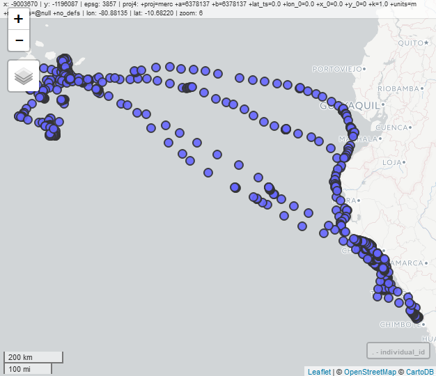

```{r setup, include = FALSE}
knitr::opts_chunk$set(echo = TRUE, cache=TRUE)
```

# Introduction
Today we are going to get our first taste of working with movement data in R, but we will begin by
introducing you to spatial data analysis in R more generally. In this section we will
review some of the R packages available for handling spatial data, discuss the
format of different spatial data types, and explore how we can manipulate and visualize these
in R. 

Much of the content and structure of this tutorial was inspired by Jamie Afflerbach's own introduction 
to the `sf` library and spatial analysis in R (see her 
[spatial-analysis-R repo](https://github.com/jafflerbach/spatial-analysis-R)). I 
have adapted it here for the specific purposes of our workshop.

## Packages

Primarily we will be introducing the  **sf** ("simple features") package for working 
with simple spatial data. 

The **sf** library is an R implementation of:  
 - a new spatial data class system in R  
 - functions for reading and writing spatial data  
 - tools for spatial operations on vectors  
 
Ultimately this seeks to replace the older **sp**, **rgdal**, **rgeos** packages 
which formed the original toolset for working with spatial data in R. The **sf** library
replaces the S4 class structure used in **sp** with simple feature access - the current standard
across industry for organizing spatial data -- extending R's data.frame structure directly
to accept spatial geometry attributes and making it easier to manipulate spatial datasets
using tools like dplyr and the tidyverse. However, as this package is new and under 
developement there are times were we will switch back to the S4 class structure to play
nice with our movement packages. 

More information regarding this shift [here](https://www.r-consortium.org/blog/2017/01/03/simple-features-now-on-cran)

Spatial data comes in two forms:

1. Vector data
2. Raster data

With important differences across classes. 

## Vector Data
Vector models are a representation of the world using points, lines, and
polygons. This class is useful for storing data that has discrete boundaries,
such as country borders, land parcels, and streets.

Often, vector data is stored as "shapefiles" (.shp)



## Raster Data
Raster models are a representation of the world as a surface divided 
into a regular grid of cells.


These are useful for storing data that 
varies continuously, as in an aerial photograph, a satellite image, 
a surface of chemical concentrations, or an elevation surface


Often, Rasters are stored as "GeoTIFFs" (.tif)

The **sf** library is used to store vector data but when working with raster data
we will use operations from packages **raster** and **velox**. 

Later when we work with movement data we may find a need for other spatial packages in R
such as: **spatial**, the **adehabitat** packages, **maptools**, **mapview**, 
and the developers version of **ggplot2**. 

# Reading, Visualizaing, and Manipulating Spatial Data in R

To begin today, we are going to demonstrate how to **sf** and **tidyverse** libraries
together to manipulate spatial *vector* data. 

## Step 1. Set up our environment and read in the data

```{r}
#install.packages(c("sf", "mapview"))
library(tidyverse)
library(sf)
library(mapview)
```

**sf** objects usually have two classes - `sf` and `data.frame`.
Two main differences comparing to a regular `data.frame` object are 
spatial metadata (`geometry type`, `dimension`, `bbox`, `epsg (SRID)`, 
`proj4string`) and additional column - typically named `geom` or `geometry`.

Today we are going to play with a shapfiles of Hong Kong's administrative boundaries
downloaded from the [global administrative areas database](http://www.gadm.org/download)
and provided for you in the `shapefiles` directory. 

Now let's use the `st_read` function to read both files in separately. Note that 
within the `sf` library most commands begin with the "st" prefix. 

```{r}
HK_boundary <- st_read("data_files/HK_boundary.shp")

HK_districts <- st_read("data_files/HK_districts.shp")
```

### Attributes of `sf` objects

Just for kicks, prove to yourself that a sf object is just a fancy data.frame:
check out the class structure of "sf" objects
```{r}
class(HK_boundary)
```

Because of their dual class structure: **sf** objects can be used as a regular 
`data.frame` object in many operations. For instance, we can call simple data.frame
operations like `nrow` or `names` on these objects with ease

```{r}
nrow(HK_districts)
ncol(HK_districts)
names(HK_districts)
```

If we are ever curious about just the dataframe or just the geometry separately, 
we can use `st_geometry` commands.  By setting the geometry to 'NULL' using `st_set_geometry`, a `sf`
object returns to a simple data.frame. Calling the `st_geometry` from an sf object 
would extract just the spatial attributes turning this into a "simple feature collection" or "sfc". 
To turn an `sfc` object back into an `sf` object use `st_sf()`.

```{r}
HK_boundary %>% class # complete sf object

HK_boundary %>% st_set_geometry(NULL) %>% class  # force to data.frame

HK_boundary %>% st_geometry() %>% class  # extract only the spatial info, force to "sfc"
```

## Step 2: Visualize

Let's take a look at our shapefiles, make sure they look like we expect. 

### sf objects and BaseR
```{r}
# look what happens when we use generic plot on the whole dataframe
HK_districts %>% plot

# pull just the geometry
HK_boundary %>% st_geometry() %>% plot
HK_districts %>% st_geometry() %>% plot

# or pull just one column
plot(HK_districts["NAME_1"])
```

### With ggplot

`ggplot2` now has integrated functionality to plot sf objects using `geom_sf()`.
If the following code isn't working, check to make sure you are using the developer's
version, `devtools::install_github("tidyverse/ggplot2")`.

```{r}
#simplest plot
ggplot(HK_districts) + geom_sf()
```

This is useful to make sure your file looks correct but doesn't display any information about the data. We can plot these regions and fill each polygon based on the rgn_id.

```{r}
ggplot(HK_districts) + geom_sf(aes(fill = NAME_1))
```

ggplot gives us useful defaults like Latitude and Longitude labels and cleaner legends but
there are even fancier things we can do with maps... we'll introduce you to one in
the `mapview` library below. 

### Getting fancy with Mapview

`mapview` is a wrapper for the `leaflet` package for R. Leaflet is a visualization
engine written in javascript that is widely used to make and embed interactive plots. 

```{r, screenshoot.force=TRUE}
map <- mapview(HK_districts)
st_sample(HK_districts, 25) -> points

#icon: http://leafletjs.com/examples/custom-icons/
#fishIcon <- makeIcon("images/lumpsucker.jpg", 18,18)
#mapview(HK_regions)@map %>% addTiles %>%  addMarkers(data = points, icon=fishIcon)

mapview(points, map, cex=3, color="red")

```

## Step 3: Mainuplate!

An important advantage of simple features in R is that their structure makes it 
easy to use the **dplyr** package on `sf` objects:

For instance, taking standard examples introduced yesterday:

`select()`

```{r select}

HK_boundary %>%
  select(ID_0, ISO, NAME_LO, SOVEREI, FIPS, ISON, POP2000, SQKM) -> HK_trim

HK_trim
```

`mutate()` & `pull()`

```{r mutate}
HK_trim %>%
  mutate(POP_per_SQKM = POP2000/SQKM) %>% pull(POP_per_SQKM)
```

`filter()`

```{r filter}

HK_districts %>%
  filter(NAME_1 %in% c("Eastern", "North", "Islands"))

HK_districts %>%
  filter(NAME_1 %in% c("Eastern", "North", "Islands")) %>% 
  ggplot(.) + geom_sf(aes(fill = NAME_1))
```


## Spatial operations
### Union
You can merge all polygons into one using `st_union()`.
```{r st_union}

full_rgn  <- st_union(HK_districts)

plot(full_rgn)
```

### Joins

Perhaps we had some points -- locations of animal observations maybe -- and we 
wanted to join them to data in a different layer -- the sf library and dplyr make
this readily doable.

Below we join the randomly sampled points from above to the HK_districts layer, to pull the relevant district information for each point. 

```{r}
st_sf(points) %>% st_join(., HK_districts)

# Similar functions are available in other libraries:
# adehabitatMA::join()
# rgeos::over
```

From there it is simple to use `group_by` and `tally` (a wrapper for the more general `summarise` function) to count how many points we sampled in each district:

```{r}
st_sf(points) %>% 
  st_join(., HK_districts) %>%
  group_by(NAME_1) %>% 
  tally()

# all while retaining the spatial geometry associated with each point. 
```

### Projections & transformations with vectors and rasters

Above we have sometimes encountered warnings like this one:
> although coordinates are longitude/latitude, st_intersects assumes that they are planar

This has to do with our coordinate system. Geographic coordinate systems give 
coordinates which are spherical (i.e. measured from the earth's center) or 
planimetric (in which the earth's coordinates are projected onto a two-dimensional planar surface). 
Most spatial operations in the sf library assume coordinates are projected into a
planar surface which typically lend themselves to more interpretable measurements e.g meters or kilometers. 

Above,  all our vector data have been in the
WGS84 spherical coordinate reference system, which uses longitude and latitude with units in degrees.
An example of this projection can be seen in the lower right depication of the US
in the image below. 


It is crucial when doing spatial analyses to know and match the coordinate systems 
across all of your datasets and ensure everything is properly projected, or your 
results may be incorrect or your analysis may fail. This is true whether you are
working with raster or vector data. 


```{r}
library(raster)

# https://landcover.usgs.gov/global_climatology.php
# download.file("https://landcover.usgs.gov/documents/GlobalLandCover_tif.zip", "data_files/Landcover.zip") 
# unzip("data_files/Landcover.zip", "data_files/")
land_cover <- raster("data_files/LCType.tif")

plot(land_cover)
crs(land_cover)
```

Perhaps we want to work with both our HK_districts and the landcover dataset 
but in a planar coordinate system. To do this with an `sf` object we use 
`st_transform`, with a raster object, `projectRaster`. 

Let's crop and transform these data into the [World Azimuthal Equidistant](https://epsg.io/54032) 
projection to compare. 

```{r}
# to save time on the projection, let's trim the extent before projecting. 
# We can do this because they are already in the same geographic crs. 
# however, the extent call doesn't recognize sf objects yet so let's temporarily switch it back to `sp` format
HK_landcover <- crop(land_cover, extent(as(HK_boundary, "Spatial")))

HK_lc_proj <- projectRaster(HK_landcover, method= 'ngb', NAflag = 0,
                                crs = "+proj=aeqd +lat_0=0 +lon_0=0 +x_0=0 +y_0=0 +datum=WGS84 +units=m +no_defs")

```

By plotting these side by side, you can really see how different projections can be!
 
```{r}
plot(HK_landcover)
plot(HK_lc_proj)
```

### Intersections & Extractions

Commonly in movement ecology, we need to extract values from rasters across our vector data
be it points where an animal walked or polygons like their home range or breeding sites for instance. 

There are a number of functions to do this sort of spatial intersect and extraction in the rgeos and 
raster libraries e.g `gIntersection` and `extract`
but they can be very inefficient in R - especially for large rasters. New libraries like
`fasterize` and `velox` have been built to make these functions significantly faster. 
Below I will introduce `velox` but you can find more information about both by
exploring their github pages. 

Say we want to know the percentage of each landcover class each district is made up of. 
We can convert to a velox object to quickly and easily extract this information and use
dplyr and purrr verbs to make a clean table of percentages by landcover class. 

```{r}
library(velox)
vx <- velox(HK_landcover) # makes a velox object from our raster

# lets give our classes names
landcover <- c("Water",
 "Evergreen Needle leaf Forest",
 "Evergreen Broadleaf Forest",
 "Deciduous Needle leaf Forest",
 "Deciduous Broadleaf Forest",	
 "Mixed Forests",
 "Closed Shrublands", 
 "Open Shrublands",
 "Woody Savannas",
 "Savannas", 
 "Grasslands", 
 "Permanent Wetland", 
 "Croplands", 
 "Urban and Built-Up",
 "Cropland/Natural Vegetation Mosaic", # #15 snow and ice not encountered
 "Barren or Sparsely Vegetated")

landcover_by_district <- vx$extract(HK_districts) %>% #extracts the raster cells in each district
  map(., plyr::count) %>%  #counts each category
  reduce(., function(dtf1,dtf2) full_join(dtf1,dtf2, by="x")) %>%  # reduces to a dataframe
  arrange(x) # orders

head(landcover_by_district)

landcover_by_district[is.na(landcover_by_district)] <- 0 # make NAs 0
names(landcover_by_district) <- c("Class_No", seq(1,18,1)) # improve column names
landcover_by_district$Class <- landcover # add a column including each landover class name

head(landcover_by_district)

district_totals <- map_dbl(landcover_by_district[,2:19], sum) #sum for each district, i.e. column
district_totals

for (i in 1:18){ # convert to percentages
  landcover_by_district[,i+1] <- round((landcover_by_district[,i+1]/district_totals[i])*100,2)
}

# transpose things a little
landcover_by_district %>%
  dplyr::select(-Class_No) %>% 
  gather(key = District_No, value = value, 1:18) %>% 
  spread(key = names(.)[1], value = 'value') %>% 
  arrange(as.numeric(District_No))  -> district_LC

head(district_LC)
```

In this format it's easy to pull out districts by their landcover characteristics. 

For instance, perhaps we want to know which districts are more than 80% Urban:
```{r}
district_LC %>% filter(`Urban and Built-Up` > 80) %>% pull(District_No)
```

We will continue to see how useful extraction in this afternoon's activity and 
we get to RSFs tomorrow.
