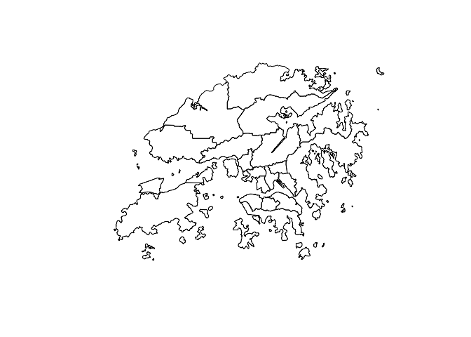
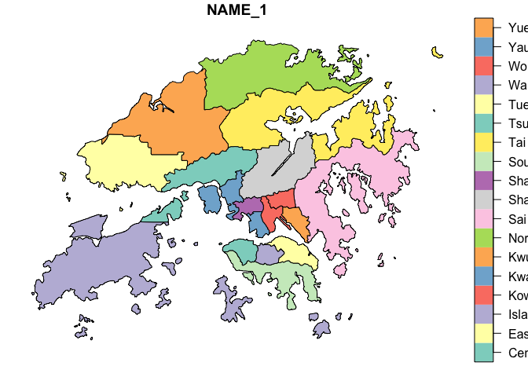
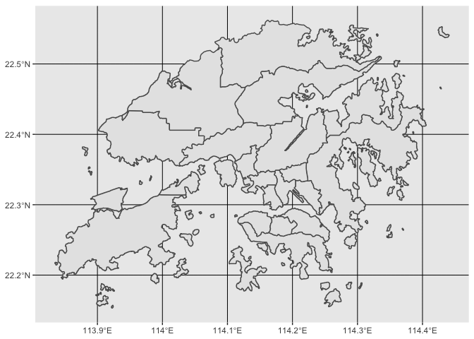
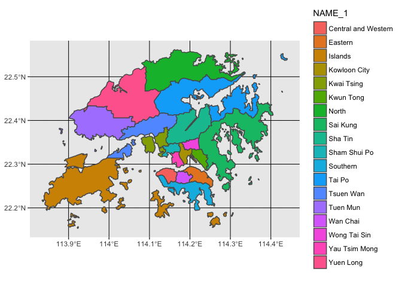
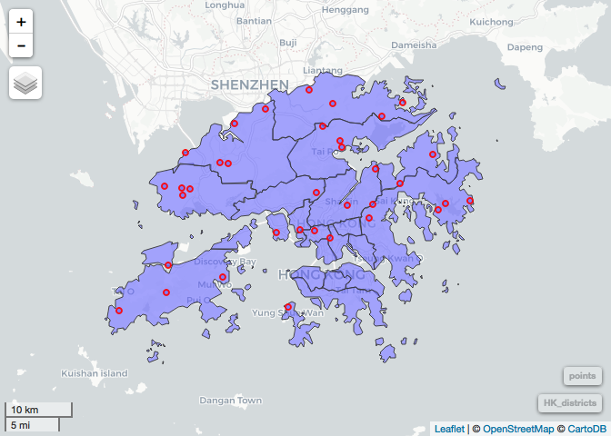
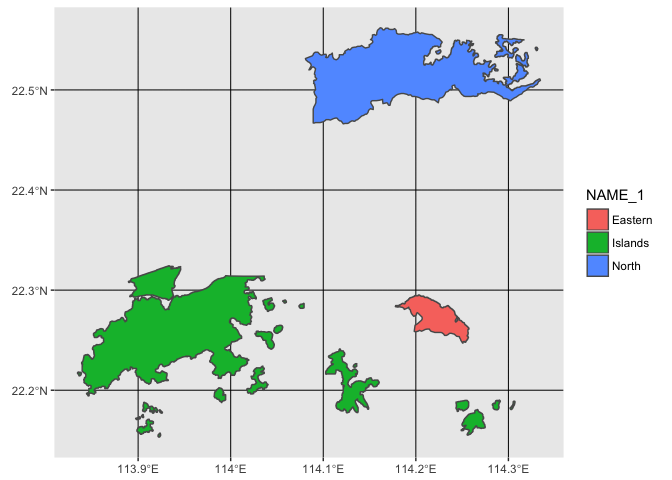
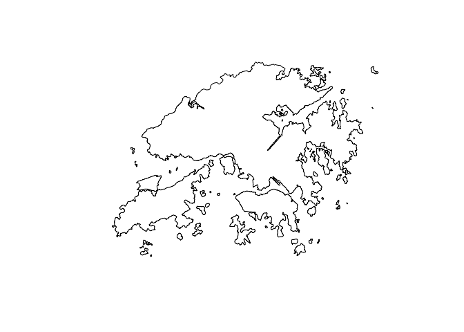

Introduction to working with Spatial Data in R
================
Dana Seidel
January 4, 2018

Introduction
============

Today we are going to get our first taste of working with movement data in R, but we will begin by introducing you to spatial data analysis in R more generally. In this section we will review some of the R packages available for handling spatial data, discuss the format of different spatial data types, and explore how we can manipulate and visualize these in R.

Much of the content and structure of this tutorial was inspired by Jamie Afflerbach's own introduction to the `sf` library and spatial analysis in R (see her [spatial-analysis-R repo](https://github.com/jafflerbach/spatial-analysis-R)). I have adapted it here for the specific purposes of our workshop.

Packages
--------

Primarily we will be introducing the **sf** ("simple features") package for working with simple spatial data.

The **sf** library is an R implementation of:
- a new spatial data class system in R
- functions for reading and writing spatial data
- tools for spatial operations on vectors

Ultimately this seeks to replace the older **sp**, **rgdal**, **rgeos** packages which formed the original toolset for working with spatial data in R. The **sf** library replaces the S4 class structure used in **sp** with simple feature access - the current standard across industry for organizing spatial data -- extending R's data.frame structure directly to accept spatial geometry attributes and making it easier to manipulate spatial datasets using tools like dplyr and the tidyverse. However, as this package is new and under developement there are times were we will switch back to the S4 class structure to play nice with our movement packages.

More information regarding this shift [here](https://www.r-consortium.org/blog/2017/01/03/simple-features-now-on-cran)

Spatial data comes in two forms:

1.  Vector data
2.  Raster data

With important differences across classes.

Vector Data
-----------

Vector models are a representation of the world using points, lines, and polygons. This class is useful for storing data that has discrete boundaries, such as country borders, land parcels, and streets.

Often, vector data is stored as "shapefiles" (.shp)


Raster Data
-----------

Raster models are a representation of the world as a surface divided into a regular grid of cells.


These are useful for storing data that varies continuously, as in an aerial photograph, a satellite image, a surface of chemical concentrations, or an elevation surface


Often, Rasters are stored as "GeoTIFFs" (.tif)

The **sf** library is used to store vector data but when working with raster data we will use operations from packages **raster** and **velox**.

Later when we work with movement data we may find a need for other spatial packages in R such as: **spatial**, the **adehabitat** packages, **maptools**, **mapview**, and the developers version of **ggplot2**.

Reading, Visualizaing, and Manipulating Spatial Data in R
=========================================================

To begin today, we are going to demonstrate how to **sf** and **tidyverse** libraries together to manipulate spatial *vector* data.

Step 1. Set up our environment and read in the data
---------------------------------------------------

``` r
#install.packages(c("sf", "mapview"))
library(tidyverse)
```

    ## ── Attaching packages ──────────────────────────────────────────────────────── tidyverse 1.2.1 ──

    ## ✔ ggplot2 2.2.1.9000     ✔ purrr   0.2.4     
    ## ✔ tibble  1.3.4          ✔ dplyr   0.7.4     
    ## ✔ tidyr   0.7.2          ✔ stringr 1.2.0     
    ## ✔ readr   1.1.1          ✔ forcats 0.2.0

    ## ── Conflicts ─────────────────────────────────────────────────────────── tidyverse_conflicts() ──
    ## ✖ dplyr::filter() masks stats::filter()
    ## ✖ dplyr::lag()    masks stats::lag()

``` r
library(sf)
```

    ## Linking to GEOS 3.6.2, GDAL 2.2.3, proj.4 4.9.3

``` r
library(mapview)
```

    ## Loading required package: leaflet

**sf** objects usually have two classes - `sf` and `data.frame`. Two main differences comparing to a regular `data.frame` object are spatial metadata (`geometry type`, `dimension`, `bbox`, `epsg (SRID)`, `proj4string`) and additional column - typically named `geom` or `geometry`.

Today we are going to play with a shapfiles of Hong Kong's administrative boundaries downloaded from the [global administrative areas database](http://www.gadm.org/download) and provided for you in the `shapefiles` directory.

Now let's use the `st_read` function to read both files in separately. Note that within the `sf` library most commands begin with the "st" prefix.

``` r
HK_boundary <- st_read("data_files/HK_boundary.shp")
```

    ## Reading layer `HK_boundary' from data source `/Users/dseidel/Desktop/HongKong/Materials/Day2/data_files/HK_boundary.shp' using driver `ESRI Shapefile'
    ## Simple feature collection with 1 feature and 69 fields
    ## geometry type:  MULTIPOLYGON
    ## dimension:      XY
    ## bbox:           xmin: 113.8346 ymin: 22.15319 xmax: 114.441 ymax: 22.56209
    ## epsg (SRID):    4326
    ## proj4string:    +proj=longlat +datum=WGS84 +no_defs

``` r
HK_districts <- st_read("data_files/HK_districts.shp")
```

    ## Reading layer `HK_districts' from data source `/Users/dseidel/Desktop/HongKong/Materials/Day2/data_files/HK_districts.shp' using driver `ESRI Shapefile'
    ## Simple feature collection with 18 features and 14 fields
    ## geometry type:  MULTIPOLYGON
    ## dimension:      XY
    ## bbox:           xmin: 113.8346 ymin: 22.15319 xmax: 114.441 ymax: 22.56209
    ## epsg (SRID):    4326
    ## proj4string:    +proj=longlat +datum=WGS84 +no_defs

### Attributes of `sf` objects

Just for kicks, prove to yourself that a sf object is just a fancy data.frame: check out the class structure of "sf" objects

``` r
class(HK_boundary)
```

    ## [1] "sf"         "data.frame"

Because of their dual class structure: **sf** objects can be used as a regular `data.frame` object in many operations. For instance, we can call simple data.frame operations like `nrow` or `names` on these objects with ease

``` r
nrow(HK_districts)
```

    ## [1] 18

``` r
ncol(HK_districts)
```

    ## [1] 15

``` r
names(HK_districts)
```

    ##  [1] "ID_0"     "ISO"      "NAME_0"   "ID_1"     "NAME_1"   "HASC_1"  
    ##  [7] "CCN_1"    "CCA_1"    "TYPE_1"   "ENGTYPE"  "NL_NAME"  "VARNAME" 
    ## [13] "Shp_Lng"  "Shap_Ar"  "geometry"

If we are ever curious about just the dataframe or just the geometry separately, we can use `st_geometry` commands. By setting the geometry to 'NULL' using `st_set_geometry`, a `sf` object returns to a simple data.frame. Calling the `st_geometry` from an sf object would extract just the spatial attributes turning this into a "simple feature collection" or "sfc". To turn an `sfc` object back into an `sf` object use `st_sf()`.

``` r
HK_boundary %>% class # complete sf object
```

    ## [1] "sf"         "data.frame"

``` r
HK_boundary %>% st_set_geometry(NULL) %>% class  # force to data.frame
```

    ## [1] "data.frame"

``` r
HK_boundary %>% st_geometry() %>% class  # extract only the spatial info, force to "sfc"
```

    ## [1] "sfc_MULTIPOLYGON" "sfc"

Step 2: Visualize
-----------------

Let's take a look at our shapefiles, make sure they look like we expect.

### sf objects and BaseR

``` r
# look what happens when we use generic plot on the whole dataframe
HK_districts %>% plot
```

    ## Warning: plotting the first 9 out of 14 attributes; use max.plot = 14 to
    ## plot all

    ## Warning in min(x): no non-missing arguments to min; returning Inf

    ## Warning in max(x): no non-missing arguments to max; returning -Inf


``` r
# pull just the geometry
HK_boundary %>% st_geometry() %>% plot
```


``` r
HK_districts %>% st_geometry() %>% plot
```



``` r
# or pull just one column
plot(HK_districts["NAME_1"])
```



### With ggplot

`ggplot2` now has integrated functionality to plot sf objects using `geom_sf()`. If the following code isn't working, check to make sure you are using the developer's version, `devtools::install_github("tidyverse/ggplot2")`.

``` r
#simplest plot
ggplot(HK_districts) + geom_sf()
```



This is useful to make sure your file looks correct but doesn't display any information about the data. We can plot these regions and fill each polygon based on the rgn\_id.

``` r
ggplot(HK_districts) + geom_sf(aes(fill = NAME_1))
```



ggplot gives us useful defaults like Latitude and Longitude labels and cleaner legends but there are even fancier things we can do with maps... we'll introduce you to one in the `mapview` library below.

### Getting fancy with Mapview

`mapview` is a wrapper for the `leaflet` package for R. Leaflet is a visualization engine written in javascript that is widely used to make and embed interactive plots.

``` r
map <- mapview(HK_districts)
st_sample(HK_districts, 25) -> points
```

    ## although coordinates are longitude/latitude, st_intersects assumes that they are planar

``` r
#icon: http://leafletjs.com/examples/custom-icons/
#fishIcon <- makeIcon("images/lumpsucker.jpg", 18,18)
#mapview(HK_regions)@map %>% addTiles %>%  addMarkers(data = points, icon=fishIcon)

mapview(points, map, cex=3, color="red")
```



Step 3: Mainuplate!
-------------------

An important advantage of simple features in R is that their structure makes it easy to use the **dplyr** package on `sf` objects:

For instance, taking standard examples introduced yesterday:

`select()`

``` r
HK_boundary %>%
  select(ID_0, ISO, NAME_LO, SOVEREI, FIPS, ISON, POP2000, SQKM) -> HK_trim

HK_trim
```

    ## Simple feature collection with 1 feature and 8 fields
    ## geometry type:  MULTIPOLYGON
    ## dimension:      XY
    ## bbox:           xmin: 113.8346 ymin: 22.15319 xmax: 114.441 ymax: 22.56209
    ## epsg (SRID):    4326
    ## proj4string:    +proj=longlat +datum=WGS84 +no_defs
    ##   ID_0 ISO   NAME_LO SOVEREI FIPS ISON POP2000 SQKM
    ## 1  102 HKG Hong Kong   China   HK  344 6859822 1092
    ##                         geometry
    ## 1 MULTIPOLYGON (((113.9240264...

`mutate()` & `pull()`

``` r
HK_trim %>%
  mutate(POP_per_SQKM = POP2000/SQKM) %>% pull(POP_per_SQKM)
```

    ## [1] 6281.888

`filter()`

``` r
HK_districts %>%
  filter(NAME_1 %in% c("Eastern", "North", "Islands"))
```

    ## Simple feature collection with 3 features and 14 fields
    ## geometry type:  MULTIPOLYGON
    ## dimension:      XY
    ## bbox:           xmin: 113.8346 ymin: 22.15319 xmax: 114.3346 ymax: 22.56209
    ## epsg (SRID):    4326
    ## proj4string:    +proj=longlat +datum=WGS84 +no_defs
    ##   ID_0 ISO    NAME_0 ID_1  NAME_1 HASC_1 CCN_1 CCA_1   TYPE_1  ENGTYPE
    ## 1  102 HKG Hong Kong    2 Eastern  HK.EA    NA  <NA> District District
    ## 2  102 HKG Hong Kong    3 Islands  HK.IS    NA  <NA> District District
    ## 3  102 HKG Hong Kong    7   North  HK.NO    NA  <NA> District District
    ##   NL_NAME VARNAME   Shp_Lng     Shap_Ar                       geometry
    ## 1    <NA>    <NA> 0.2929576 0.001657421 MULTIPOLYGON (((114.1779174...
    ## 2    <NA>    <NA> 2.7542074 0.015733596 MULTIPOLYGON (((113.9337463...
    ## 3    <NA>    <NA> 1.4650372 0.012136878 MULTIPOLYGON (((114.2356948...

``` r
HK_districts %>%
  filter(NAME_1 %in% c("Eastern", "North", "Islands")) %>% 
  ggplot(.) + geom_sf(aes(fill = NAME_1))
```



Spatial operations
------------------

### Union

You can merge all polygons into one using `st_union()`.

``` r
full_rgn  <- st_union(HK_districts)

plot(full_rgn)
```



### Joins

Perhaps we had some points -- locations of animal observations maybe -- and we wanted to join them to data in a different layer -- the sf library and dplyr make this readily doable.

Below we join the randomly sampled points from above to the HK\_districts layer, to pull the relevant district information for each point.

``` r
st_sf(points) %>% st_join(., HK_districts)
```

    ## although coordinates are longitude/latitude, st_intersects assumes that they are planar

    ## Simple feature collection with 24 features and 14 fields
    ## geometry type:  POINT
    ## dimension:      XY
    ## bbox:           xmin: 113.8597 ymin: 22.22392 xmax: 114.3471 ymax: 22.54966
    ## epsg (SRID):    4326
    ## proj4string:    +proj=longlat +datum=WGS84 +no_defs
    ## First 10 features:
    ##    ID_0 ISO    NAME_0 ID_1    NAME_1 HASC_1 CCN_1 CCA_1   TYPE_1  ENGTYPE
    ## 1   102 HKG Hong Kong    3   Islands  HK.IS    NA  <NA> District District
    ## 2   102 HKG Hong Kong    9   Sha Tin  HK.ST    NA  <NA> District District
    ## 3   102 HKG Hong Kong   14  Tuen Mun  HK.TM    NA  <NA> District District
    ## 4   102 HKG Hong Kong   11  Southern  HK.SO    NA  <NA> District District
    ## 5   102 HKG Hong Kong    6 Kwun Tong  HK.KU    NA  <NA> District District
    ## 6   102 HKG Hong Kong   13 Tsuen Wan  HK.TW    NA  <NA> District District
    ## 7   102 HKG Hong Kong   12    Tai Po  HK.TP    NA  <NA> District District
    ## 8   102 HKG Hong Kong    3   Islands  HK.IS    NA  <NA> District District
    ## 9   102 HKG Hong Kong   12    Tai Po  HK.TP    NA  <NA> District District
    ## 10  102 HKG Hong Kong    8  Sai Kung  HK.SK    NA  <NA> District District
    ##    NL_NAME VARNAME   Shp_Lng     Shap_Ar                       geometry
    ## 1     <NA>    <NA> 2.7542074 0.015733596 POINT (113.859657056394 22....
    ## 2     <NA>    <NA> 0.5821248 0.005895610 POINT (114.185894329297 22....
    ## 3     <NA>    <NA> 0.7959588 0.007939630 POINT (113.923209938586 22....
    ## 4     <NA>    <NA> 0.8811445 0.003718947 POINT (114.168049511398 22....
    ## 5     <NA>    <NA> 0.1927009 0.001029288 POINT (114.210146803441 22....
    ## 6     <NA>    <NA> 0.7908177 0.005404587 POINT (114.041411801872 22....
    ## 7     <NA>    <NA> 1.9998019 0.013501973 POINT (114.343913556551 22....
    ## 8     <NA>    <NA> 2.7542074 0.015733596 POINT (113.951472191416 22....
    ## 9     <NA>    <NA> 1.9998019 0.013501973 POINT (114.347111770318 22....
    ## 10    <NA>    <NA> 2.5614897 0.012582268 POINT (114.307721735027 22....

``` r
# Similar functions are available in other libraries:
# adehabitatMA::join()
# rgeos::over
```

From there it is simple to use `group_by` and `tally` (a wrapper for the more general `summarise` function) to count how many points we sampled in each district:

``` r
st_sf(points) %>% 
  st_join(., HK_districts) %>%
  group_by(NAME_1) %>% 
  tally()
```

    ## although coordinates are longitude/latitude, st_intersects assumes that they are planar

    ## Simple feature collection with 11 features and 2 fields
    ## geometry type:  GEOMETRY
    ## dimension:      XY
    ## bbox:           xmin: 113.8597 ymin: 22.22392 xmax: 114.3471 ymax: 22.54966
    ## epsg (SRID):    4326
    ## proj4string:    +proj=longlat +datum=WGS84 +no_defs
    ## # A tibble: 11 x 3
    ##        NAME_1     n          geometry
    ##        <fctr> <int>  <simple_feature>
    ##  1    Islands     4 <MULTIPOINT (...>
    ##  2 Kwai Tsing     1 <POINT (114.1...>
    ##  3  Kwun Tong     1 <POINT (114.2...>
    ##  4      North     3 <MULTIPOINT (...>
    ##  5   Sai Kung     2 <MULTIPOINT (...>
    ##  6    Sha Tin     2 <MULTIPOINT (...>
    ##  7   Southern     2 <MULTIPOINT (...>
    ##  8     Tai Po     2 <MULTIPOINT (...>
    ##  9  Tsuen Wan     2 <MULTIPOINT (...>
    ## 10   Tuen Mun     4 <MULTIPOINT (...>
    ## 11  Yuen Long     1 <POINT (114.0...>

``` r
# all while retaining the spatial geometry associated with each point. 
```

### Projections & transformations with vectors and rasters

Above we have sometimes encountered warnings like this one: &gt; although coordinates are longitude/latitude, st\_intersects assumes that they are planar

This has to do with our coordinate system. Geographic coordinate systems give coordinates which are spherical (i.e. measured from the earth's center) or planimetric (in which the earth's coordinates are projected onto a two-dimensional planar surface). Most spatial operations in the sf library assume coordinates are projected into a planar surface which typically lend themselves to more interpretable measurements e.g meters or kilometers.

Above, all our vector data have been in the WGS84 spherical coordinate reference system, which uses longitude and latitude with units in degrees. An example of this projection can be seen in the lower right depication of the US in the image below.


It is cruial when doing spatial analyses to know and match the coordinate systems across all of your datasets and ensure everything is properly projected, or your results may be incorrect or your analysis may fail. This is true whether you are working with raster or vector data.

``` r
library(raster)
```

    ## Loading required package: sp

    ## 
    ## Attaching package: 'raster'

    ## The following object is masked from 'package:dplyr':
    ## 
    ##     select

    ## The following object is masked from 'package:tidyr':
    ## 
    ##     extract

    ## The following object is masked from 'package:ggplot2':
    ## 
    ##     calc

``` r
# https://landcover.usgs.gov/global_climatology.php
# download.file("https://landcover.usgs.gov/documents/GlobalLandCover_tif.zip", "data_files/Landcover.zip") 
# unzip("data_files/Landcover.zip", "data_files/")
land_cover <- raster("data_files/LCType.tif")

plot(land_cover)
```


``` r
crs(land_cover)
```

    ## CRS arguments:
    ##  +proj=longlat +datum=WGS84 +no_defs +ellps=WGS84 +towgs84=0,0,0

Perhaps we want to work with both our HK\_districts and the landcover dataset but in a planar coordinate system

``` r
HK_landcover <- crop(land_cover, extent(as(HK_boundary, "Spatial")))
```

### intersections, extractions

``` r
library(velox)
vx <- velox(HK_landcover)

landcover <- c("Water",
 "Evergreen Needle leaf Forest",
  "Evergreen Broadleaf Forest",
 "Deciduous Needle leaf Forest",
 "Deciduous Broadleaf Forest",  
 "Mixed Forests",
 "Closed Shrublands", 
 "Open Shrublands",
 "Woody Savannas",
 "Savannas", 
 "Grasslands", 
 "Permanent Wetland", 
 "Croplands", 
 "Urban and Built-Up",
 "Cropland/Natural Vegetation Mosaic", # #15 snow and ice not encountered
 "Barren or Sparsely Vegetated")

landcover_by_district <- vx$extract(HK_districts) %>% 
  map(., plyr::count) %>% 
  reduce(., function(dtf1,dtf2) full_join(dtf1,dtf2, by="x")) %>% 
  arrange(x) 

landcover_by_district[is.na(landcover_by_district)] <- 0
names(landcover_by_district) <- c("Class_No", seq(1,18,1))
landcover_by_district$Class <- landcover

district_totals <- map_dbl(landcover_by_district[,2:19], sum)

for (i in 1:18){
  landcover_by_district[,i+1] <- round((landcover_by_district[,i+1]/district_totals[i])*100,2)
}
```
