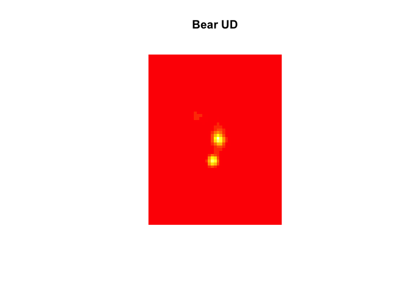

Day 3 - MCP & Kernel Density estimation
================
Dana Seidel & Eric Dougherty
January 5, 2018

``` r
library(tidyverse)
```

    ## ── Attaching packages ──────────────────────────────────────────────── tidyverse 1.2.1 ──

    ## ✔ ggplot2 2.2.1.9000     ✔ purrr   0.2.4     
    ## ✔ tibble  1.3.4          ✔ dplyr   0.7.4     
    ## ✔ tidyr   0.7.2          ✔ stringr 1.2.0     
    ## ✔ readr   1.1.1          ✔ forcats 0.2.0

    ## ── Conflicts ─────────────────────────────────────────────────── tidyverse_conflicts() ──
    ## ✖ dplyr::filter() masks stats::filter()
    ## ✖ dplyr::lag()    masks stats::lag()

``` r
library(sf)
```

    ## Linking to GEOS 3.6.2, GDAL 2.2.3, proj.4 4.9.3

``` r
library(adehabitatHR)
```

    ## Loading required package: sp

    ## Loading required package: deldir

    ## deldir 0.1-14

    ## Loading required package: ade4

    ## Loading required package: adehabitatMA

    ## Loading required package: adehabitatLT

    ## Loading required package: CircStats

    ## Loading required package: MASS

    ## 
    ## Attaching package: 'MASS'

    ## The following object is masked from 'package:dplyr':
    ## 
    ##     select

    ## Loading required package: boot

    ## 
    ## Attaching package: 'adehabitatLT'

    ## The following object is masked from 'package:dplyr':
    ## 
    ##     id

``` r
library(move)
```

    ## Loading required package: geosphere

    ## Loading required package: raster

    ## 
    ## Attaching package: 'raster'

    ## The following objects are masked from 'package:MASS':
    ## 
    ##     area, select

    ## The following object is masked from 'package:adehabitatMA':
    ## 
    ##     buffer

    ## The following object is masked from 'package:dplyr':
    ## 
    ##     select

    ## The following object is masked from 'package:tidyr':
    ## 
    ##     extract

    ## The following object is masked from 'package:ggplot2':
    ## 
    ##     calc

    ## Loading required package: rgdal

    ## rgdal: version: 1.2-16, (SVN revision 701)
    ##  Geospatial Data Abstraction Library extensions to R successfully loaded
    ##  Loaded GDAL runtime: GDAL 2.1.3, released 2017/20/01
    ##  Path to GDAL shared files: /Library/Frameworks/R.framework/Versions/3.4/Resources/library/rgdal/gdal
    ##  GDAL binary built with GEOS: FALSE 
    ##  Loaded PROJ.4 runtime: Rel. 4.9.3, 15 August 2016, [PJ_VERSION: 493]
    ##  Path to PROJ.4 shared files: /Library/Frameworks/R.framework/Versions/3.4/Resources/library/rgdal/proj
    ##  Linking to sp version: 1.2-5

    ## 
    ## Attaching package: 'move'

    ## The following object is masked from 'package:adehabitatLT':
    ## 
    ##     burst

Today we are going to explore 2 of 3 main methods for home range estimation in R. Eric will touch on the 3rd - convex hull methods - on Tuesday. Today, we will again work primarily with the adehabitatHR library and the move library. Most of this code and text is an adaptation of the extensive adehabitatHR vignettes, which we encourange you to consult for further detail and references.

Minimum Convex Polygon
======================

As dicussed in lecture, the simplest delineation of a home range is an MCP, creating the polygon of minimum area around a certain percentage of relocation points. The MCP is simple and used widely in ecology.

If you are curious to estimate the overall area of your animal's home range the `move` package includes a function to bootstrap the mcp estimation:

``` r
data(leroy) # a package moveobject
hrBootstrap(x=leroy, rep=25, unin='km', unout='km2')
```

    ## 5 6 8 10 13 16 20 25 32 40 50 63 79 100 126 158 199 251 315 397 500 629 792


    ##               0%          25%          50%          75%         100%
    ## 5   8.978445e-06 0.0001052523 0.0001645262 0.0002147004 0.0004157071
    ## 6   2.180859e-05 0.0001795047 0.0002404385 0.0003533369 0.0007056715
    ## 8   2.465420e-05 0.0002763143 0.0004259096 0.0007897061 0.0010459739
    ## 10  2.961152e-04 0.0004763226 0.0005903476 0.0007156779 0.0010503158
    ## 13  3.040147e-04 0.0007619392 0.0008945842 0.0010349176 0.0012507532
    ## 16  5.664952e-04 0.0008226903 0.0009363142 0.0010944877 0.0014561612
    ## 20  6.581103e-04 0.0009510357 0.0010784504 0.0011916543 0.0014137666
    ## 25  7.084129e-04 0.0009597377 0.0012685282 0.0014374069 0.0015825768
    ## 32  6.901988e-04 0.0010272004 0.0011802474 0.0013053118 0.0016392257
    ## 40  9.317665e-04 0.0013039505 0.0013935792 0.0015110635 0.0016401193
    ## 50  1.122412e-03 0.0013385014 0.0014273540 0.0015045580 0.0018235363
    ## 63  1.210111e-03 0.0014393667 0.0015313083 0.0016190924 0.0017667257
    ## 79  1.283185e-03 0.0014962991 0.0016216231 0.0017016901 0.0018579871
    ## 100 1.531945e-03 0.0015953028 0.0016474254 0.0017344883 0.0018792156
    ## 126 1.542408e-03 0.0016766245 0.0017849815 0.0018306165 0.0019282080
    ## 158 1.624824e-03 0.0017410992 0.0018073368 0.0018561601 0.0020307240
    ## 199 1.635711e-03 0.0017693094 0.0018350176 0.0019056087 0.0019959936
    ## 251 1.755432e-03 0.0018196247 0.0018876122 0.0019543831 0.0020262345
    ## 315 1.757415e-03 0.0018863854 0.0019276963 0.0019859969 0.0020390655
    ## 397 1.765097e-03 0.0018582119 0.0019677076 0.0020139379 0.0020611044
    ## 500 1.790009e-03 0.0019446187 0.0020024640 0.0020272493 0.0020863660
    ## 629 1.838760e-03 0.0019773857 0.0020242672 0.0020915914 0.0021265469
    ## 792 1.889963e-03 0.0019881364 0.0020441025 0.0020652984 0.0021290657

The resulting table and plot can give you a fairly quick estimate of your animals stable home range. Note that this method works especially well for a territorial animal like a fisher, but might appear much less stable for a migratory or nomadic individual.

If, however, you need to delineate the boundaries of the MCP, the adehabitatHR library has more options for you. The `mcp` function allows you to specify the percentage of coordinates to be included and works on any two column dataframe specifying the coordinates of animal relocations:

``` r
data(bear)
xy <- SpatialPoints(na.omit(ld(bear)[,1:2]))

mcp <- mcp(xy, percent=90)

ggplot() + geom_sf(data = st_as_sf(mcp)) + geom_sf(data=st_as_sf(xy))
```


Yikes! look at all that "unused" space contained within even a 90% mcp!

We'll get to better metrics shortly but if you want to compare the area of your mcp across percentages, the `mcp.area` function works well:

``` r
mcp.area(xy, percent = seq(20,100, by = 5),
         unin = c("m", "km"),
         unout = c("ha", "km2", "m2"), plotit = TRUE)
```


    ##             a
    ## 20   103.1981
    ## 25   133.9152
    ## 30   157.8969
    ## 35   330.6820
    ## 40   536.9781
    ## 45   788.9646
    ## 50   942.7685
    ## 55  1326.5800
    ## 60  1627.3274
    ## 65  1667.6074
    ## 70  1924.5011
    ## 75  1928.3710
    ## 80  2035.2868
    ## 85  2353.3132
    ## 90  2985.5309
    ## 95  3654.5171
    ## 100 3743.5210

If you are curious to see, what's going on under the hood of the adehabitatHR mcp functions, I recommend checking out [this blog post](https://www.r-bloggers.com/home-range-estimation-mcp) on the subject by Mitchell Gritts.

Kernel Density Estimation
=========================

Worton Kernel UD
----------------

The "classical" utilization distribution: Worton (1995)

> The Utilization Distribution (UD) is the bivariate function giving the probability density that an animal is found at a point according to its geographical coordinates. Using this model, one can define the home range as the minimum area in which an animal has some specified probability of being located.

``` r
kud <- kernelUD(xy)  # h = href is the default - ad hoc method for determining h
image(kud) + title("Bear UD")
```



    ## integer(0)

``` r
## Kernel home range
jj <- kernel.area(kud)                  ## home range size
plot(jj)                                   ## Plots home range size
```


``` r
ver95 <- getverticeshr(kud) ## home-range contours
ver80  <- getverticeshr(kud, percent = 80)
plot(ver95)  + plot(ver80, add=TRUE, col="green")  +  points(xy)   ## Plots contours
```


    ## integer(0)

Additional Resources/Methods:
=============================

The above is only one of the many methods adehabitatHR library contains to calculate home ranges, complete list below:

1.  The Minimum Convex Polygon (Mohr, 1947)

2.  Several kernel home range methods:

-   The “classical” kernel method (Worton, 1989)
-   the Brownian bridge kernel method (Bullard, 1999, Horne et al.

1.  **the only temporal kernel method included in adehabitatHR**

-   The Biased random bridge kernel method, also called “movementbased kernel estimation” (Benhamou and Cornelis, 2010, Benhamou,

1.  

-   the product kernel algorithm (Keating and Cherry, 2009).

1.  Several home-range estimation methods relying on the calculation of convex hulls:

-   The modification by Kenward et al. (2001) of the single-linkage clustering algorithm
-   The three LoCoH (Local Convex Hull) methods developed by Getz et al. (2007)
-   The characteristic hull method of Downs and Horner (2009)

Temporal Kernel Methods
-----------------------

-   Autocorrelated Kernel Density Estimation <https://cran.r-project.org/web/packages/ctmm/vignettes/akde.html>
