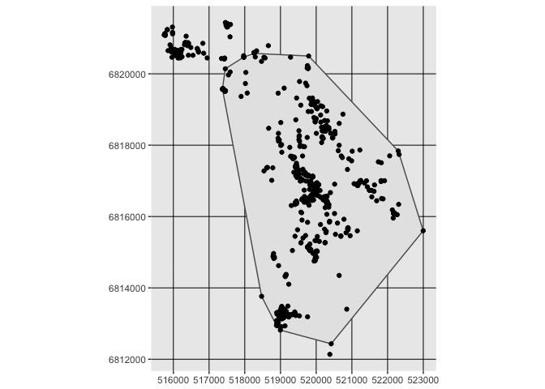

Day 3 - MCP & Home Ranges
================
Dana Seidel & Eric Dougherty
January 5, 2018

``` r
library(tidyverse)
library(sf)
```

    ## Linking to GEOS 3.6.2, GDAL 2.2.3, proj.4 4.9.3

``` r
library(adehabitatHR)
library(move)
```

Today we are going to explore 3 main methods for home range estimation in R. We will again work primarily with the adehabitatHR library and the move library. Most of this code and text is an adaptation of the extensive adehabitatHR vignettes, which we encourange you to consult for further detail and references.

The adehabitatHR library contains methods to calculate:

1.  The Minimum Convex Polygon (Mohr, 1947);
2.  Several kernel home range methods:

-   The “classical” kernel method (Worton, 1989)
-   the Brownian bridge kernel method (Bullard, 1999, Horne et al. 2007);
-   The Biased random bridge kernel method, also called “movementbased kernel estimation” (Benhamou and Cornelis, 2010, Benhamou, 2011);
-   the product kernel algorithm (Keating and Cherry, 2009).

1.  Several home-range estimation methods relying on the calculation of convex hulls:

-   The modification by Kenward et al. (2001) of the single-linkage clustering algorithm;
-   The three LoCoH (Local Convex Hull) methods developed by Getz et al. (2007)
-   The characteristic hull method of Downs and Horner (2009)

Today we will explore the MCP method, the classical and brownian kernal methods, and Getz's LoCoH methods. Code and comparison across methods are well described in the adehabitat vignette and the cited literature.

Minimum Convex Polygon
======================

As dicussed in lecture, the simplest delineation of a home range is an MCP, creating the polygon of minimum area around a certain percentage of relocation points. The MCP is simple and used widely in ecology.

If you are curious to estimate the overall area of your animal's home range the `move` package includes a function to bootstrap the mcp estimation:

``` r
data(leroy) # a package moveobject
hrBootstrap(x=leroy, rep=25, unin='km', unout='km2')
```

    ## 5 6 8 10 13 16 20 25 32 40 50 63 79 100 126 158 199 251 315 397 500 629 792


    ##               0%          25%          50%          75%         100%
    ## 5   1.376106e-05 5.666439e-05 0.0001708417 0.0002745240 0.0009589622
    ## 6   1.959336e-05 1.303149e-04 0.0002256706 0.0003625721 0.0006758380
    ## 8   3.538619e-05 3.074322e-04 0.0004521150 0.0006066670 0.0010443492
    ## 10  2.213253e-04 4.971669e-04 0.0006045518 0.0006968468 0.0010862072
    ## 13  1.939718e-04 6.411796e-04 0.0007402875 0.0008751532 0.0012020402
    ## 16  4.812604e-04 8.002104e-04 0.0009780716 0.0011486267 0.0013370538
    ## 20  5.353178e-04 9.138726e-04 0.0011162945 0.0012223571 0.0015806552
    ## 25  7.800519e-04 9.447106e-04 0.0011000437 0.0012683855 0.0014250126
    ## 32  8.740705e-04 1.006664e-03 0.0011833695 0.0012981370 0.0014467136
    ## 40  1.079320e-03 1.297424e-03 0.0013631284 0.0014951065 0.0016293535
    ## 50  9.066580e-04 1.212892e-03 0.0013381236 0.0014326812 0.0017376459
    ## 63  1.208466e-03 1.438053e-03 0.0014953086 0.0016139765 0.0017354618
    ## 79  1.349554e-03 1.538076e-03 0.0016640764 0.0017808363 0.0018707857
    ## 100 1.343898e-03 1.557218e-03 0.0017038226 0.0017891605 0.0018941113
    ## 126 1.453848e-03 1.655634e-03 0.0017417066 0.0018103792 0.0018965482
    ## 158 1.604111e-03 1.710880e-03 0.0017935978 0.0018579293 0.0020310500
    ## 199 1.628611e-03 1.794001e-03 0.0018396412 0.0019036234 0.0019904504
    ## 251 1.656854e-03 1.784722e-03 0.0018736954 0.0018999035 0.0020330751
    ## 315 1.648888e-03 1.870010e-03 0.0019374123 0.0019852286 0.0020829899
    ## 397 1.851801e-03 1.933133e-03 0.0019741329 0.0020491275 0.0021004734
    ## 500 1.837034e-03 1.927985e-03 0.0019818156 0.0020424590 0.0020787772
    ## 629 1.879881e-03 1.939188e-03 0.0020217875 0.0020767845 0.0021143869
    ## 792 1.935852e-03 2.022863e-03 0.0020553561 0.0021063646 0.0021510381

The resulting table and plot can give you a fairly quick estimate of your animals stable home range. Note that this method works especially well for a territorial animal like a fisher, but might appear much less stable for a migratory or nomadic individual.

If, however, you need to delineate the boundaries of the MCP, the adehabitatHR library has more options for you. The `mcp` function allows you to specify the percentage of coordinates to be included and works on any two column dataframe specifying the coordinates of animal relocations:

``` r
library(adehabitatHR)

data(bear)
xy <- SpatialPoints(na.omit(ld(bear)[,1:2]))

mcp <- mcp(xy, percent=90)

ggplot() + geom_sf(data = st_as_sf(mcp)) + geom_sf(data=st_as_sf(xy))
```



Yikes! look at all that "unused" space contained within even a 90% mcp!

We'll get to better metrics shortly but if you want to compare the area of your mcp across percentages, the `mcp.area` function works well:

``` r
mcp.area(xy, percent = seq(20,100, by = 5),
         unin = c("m", "km"),
         unout = c("ha", "km2", "m2"), plotit = TRUE)
```


    ##             a
    ## 20   103.1981
    ## 25   133.9152
    ## 30   157.8969
    ## 35   330.6820
    ## 40   536.9781
    ## 45   788.9646
    ## 50   942.7685
    ## 55  1326.5800
    ## 60  1627.3274
    ## 65  1667.6074
    ## 70  1924.5011
    ## 75  1928.3710
    ## 80  2035.2868
    ## 85  2353.3132
    ## 90  2985.5309
    ## 95  3654.5171
    ## 100 3743.5210

If you are curious to see, what's going on under the hood of the adehabitatHR mcp functions, I recommend checking out [this blog post](https://www.r-bloggers.com/home-range-estimation-mcp) on the subject by Mitchell Gritts.

Worton Kernel UD
================

<https://www.r-bloggers.com/adehabitathr-visualization/> <https://www.r-bloggers.com/visualizing-utilization-distributions-again/> adehabitatHR

``` r
kud <- kernelUD(xy, h="href")
image(kud) + title("Bear UD")
```


    ## integer(0)

``` r
## Kernel home range
jj <- kernel.area(kud)                  ## home range size
plot(jj)                                   ## Plots home range size
```


``` r
ver95 <- getverticeshr(kud) ## home-range contours
ver80  <- getverticeshr(kud, percent = 80)
plot(ver95)  + plot(ver80, add=TRUE, col="green")  +  points(xy)   ## Plots contours
```


    ## integer(0)

Brownian Bridge Methods
=======================

Kernel BB
---------

``` r
#sig1   
#first smoothing parameter for the brownian bridge method (related to the speed of the animals; it can be estimated by the function liker).
#sig2   
#second smoothing parameter for the brownian bridge method (related to the imprecision of the relocations, supposed known).

# estimate sig1
liker(bear, sig2 = 30, rangesig1 = c(1, 10))
```


    ## *****************************************
    ## 
    ## Maximization of the log-likelihood for parameter
    ## sig1 of brownian bridge
    ## 
    ## W0208 : Sig1 = 3.3153 Sig2 = 30

``` r
kud <- kernelbb(bear, sig1 = 3.3153, sig2 = 30)
image(kud) + title("Bear bb_UD")
```


    ## integer(0)

``` r
## Kernel home range
jj <- kernel.area(kud)                  ## home range size
plot(jj)                                   ## Plots home range size
```


``` r
ver95 <- getverticeshr(kud) ## home-range contours
ver80  <- getverticeshr(kud, percent = 80)
plot(ver95)  + plot(ver80, add=TRUE, col="green")  +  points(xy)   ## Plots contours
```


    ## integer(0)

Dynamic Brownian Bridge UD
--------------------------

``` r
library(move)
bear_move <- move(x=bear[[1]]$x, y=bear[[1]]$y, time=bear[[1]]$date, proj="+init=epsg:3857")
```

    ## Warning in .local(x, y, time, data, proj, ...): There were NA locations
    ## detected and omitted. Currently they are not stored in unusedrecords

``` r
BB.bear <- brownian.bridge.dyn(bear_move, 
                                dimSize=150, 
                                location.error=30,  #can also provide vector with changing positional errors
                                margin=21,
                                ext=.5,
                                window.size=99, 
                                time.step=2) 
```

    ## Computational size: 2.6e+08

``` r
udbear <- getVolumeUD(BB.bear)

plot(bear_move, col="#00000060", pch=16, cex=0.5,
     bty="n", xaxt="n", yaxt="n", xlab=NA, ylab=NA) +
lines(bear_move, col="#00000030") +
# add isopleths
contour(udbear, levels=c(0.5, 0.95), add=TRUE, lwd=c(2, 1), lty=c(2,1), col = c("orange", "blue"))+
  title("Dynamic brownian bridge")
```


    ## integer(0)

Much much much tighter contours!

Local-Convex-Hull Methods
-------------------------

The LoCoH (Local Convex Hulls) family of methods has been proposed by Getz et al. (2007) for locating Utilization Distributions from relocation data. Three possible algorithms can be used: Fixed k LoCoH, Fixed r LoCoH, and Adaptive LoCoH. The three algorithms are implemented in adehabitatHR. All the algorithms work by constructing a small convex hull for each relocation and its neighbours, and then incrementally merging the hulls together from smallest to largest into isopleths. The 10% isopleth contains 10% of the points and represents a higher utilization than the 100% isopleth that contains all the points (as for the single linkage method). The three methods are as follows:

-   Fixed k LoCoH: Also known as k-NNCH, Fixed k LoCoH is described in Getz and Willmers (2004). The convex hull for each point is constructed from the (k-1) nearest neighbors to that point. Hulls are merged together from smallest to largest based on the area of the hull. This method is implemented in the function `LoCoH.k`
-   Fixed r LoCoH: In this case, hulls are created from all points within r distance of the root point. When merging hulls, the hulls are primarily sorted by the value of k generated for each hull (the number of points contained in the hull), and secondly by the area of the hull. This method is implemented in the function `LoCoH.r`
-   Adaptive LoCoH: Here, hulls are created out of the maximum nearest neighbors such that the sum of the distances from the nearest neighbors is less than or equal to d. Use the same hull sorting as Fixed r LoCoH. This method is implemented in the function `LoCoH.a`

All of these algorithms can take a significant amount of time
