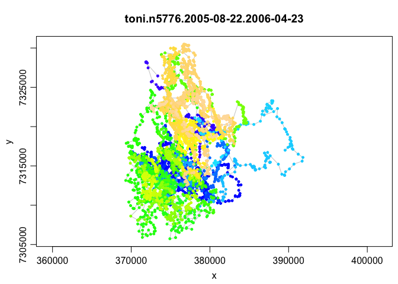
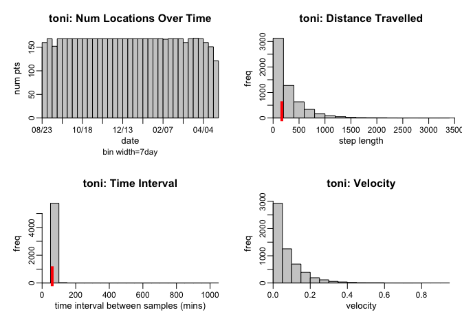
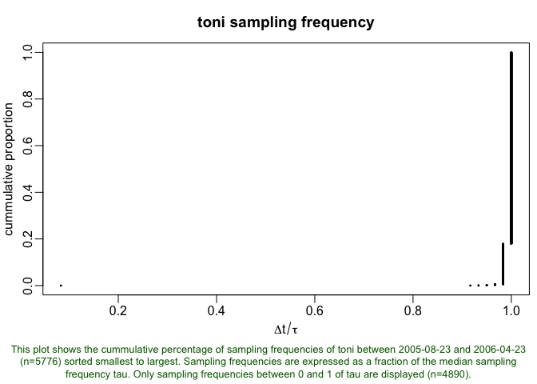
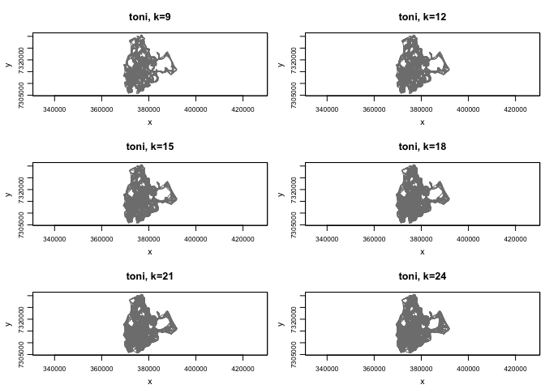
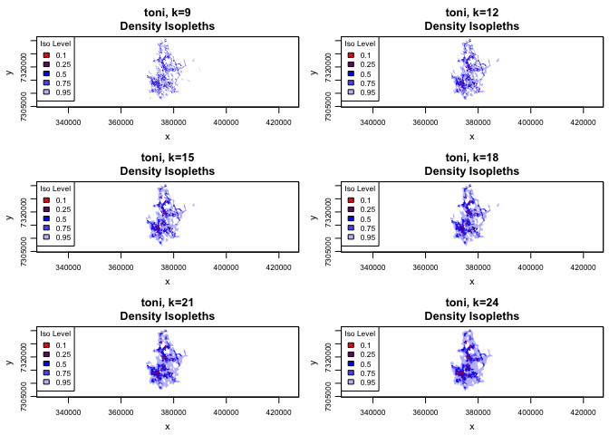
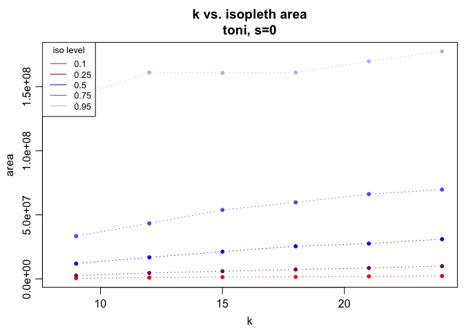

LoCoH
================

Our walkthrough today will generally follow the guideline laid out by Andy Lyons (an alum of the Getz lab) when he first published his T-LoCoH paper in Movement Ecology. The PDF of that tutorial can be found in our Day 4 folder and also at: [T-LoCoH Tutorial](http://tlocoh.r-forge.r-project.org/tlocoh_tutorial_2014-08-17.pdf)

Just like we have been doing for the past few days, the first step will be installing the tlocoh package and getting it loaded into our R session. Unlike some of our previous examples, though, this particular package is housed on R-Forge rather than CRAN. This means we will need to use an additional argument or two:

``` r
#install.packages("tlocoh", dependencies=T, repos=c("http://R-Forge.R-project.org"))
library(tlocoh)
```

    ## Loading required package: sp

    ## T-LoCoH for R (version 1.40.04)
    ## URL: http://tlocoh.r-forge.r-project.org/
    ## Bug reports: tlocoh@gmail.com

The first step for us will be to load in one of the datasets included in the package. All we need to do is:

``` r
data(toni)
```

Toni is the name that researchers from the Getz Lab gave to one of the African buffalo they studied in the Kruger National Park in South Africa during a study of bovine tuberculosis. Let's take a look at her data using the `base::head` command:

``` r
dim(toni)
```

    ## [1] 6371    4

``` r
head(toni)
```

    ##         id     long       lat           timestamp.utc
    ## 17930 toni 31.75345 -24.16950 2005-08-23 06:35:00.000
    ## 17931 toni 31.73884 -24.15402 2005-08-23 07:34:00.000
    ## 17932 toni 31.73969 -24.15359 2005-08-23 08:34:00.000
    ## 17933 toni 31.73874 -24.15329 2005-08-23 09:35:00.000
    ## 17934 toni 31.73946 -24.15336 2005-08-23 10:34:00.000
    ## 17935 toni 31.73898 -24.15363 2005-08-23 11:35:00.000

We can see that we have 6371 data points for Toni. We can also see that the positional fixes are in the form of latitude and longitude. In order to use these data for our analyses here, we will need to convert these lat-long points into a meaningful geographic projection such as UTM, which will transform the points from degrees to meters. Knowing that these data are from South Africa, we can determine the UTM zone in which these data were collection (Zone 36S). In order to reproject the data, we will need two more packages that we have dealt with in the past, sp and rgdal. The first order of business is to create a SpatialPoints object with a defined projection (longlat, in this case). Then, we will transform the underlying projection to one more suited to our needs:

``` r
library(sp)
library(rgdal)
```

    ## rgdal: version: 1.2-16, (SVN revision 701)
    ##  Geospatial Data Abstraction Library extensions to R successfully loaded
    ##  Loaded GDAL runtime: GDAL 2.1.3, released 2017/20/01
    ##  Path to GDAL shared files: /Library/Frameworks/R.framework/Versions/3.4/Resources/library/rgdal/gdal
    ##  GDAL binary built with GEOS: FALSE 
    ##  Loaded PROJ.4 runtime: Rel. 4.9.3, 15 August 2016, [PJ_VERSION: 493]
    ##  Path to PROJ.4 shared files: /Library/Frameworks/R.framework/Versions/3.4/Resources/library/rgdal/proj
    ##  Linking to sp version: 1.2-5

``` r
toni.sp.latlong <- SpatialPoints(toni[ , c("long","lat")], proj4string=CRS("+proj=longlat +ellps=WGS84"))
toni.sp.utm <- spTransform(toni.sp.latlong, CRS("+proj=utm +south +zone=36 +ellps=WGS84")) 
```

Now we can take a look at the coordinates to make sure they are no longer in degrees:

``` r
toni.mat.utm <- coordinates(toni.sp.utm)
head(toni.mat.utm)
```

    ##           long     lat
    ## 17930 373372.0 7326443
    ## 17931 371872.3 7328144
    ## 17932 371958.1 7328192
    ## 17933 371861.3 7328225
    ## 17934 371934.5 7328218
    ## 17935 371886.0 7328187

Looks like we were successful! The only thing left to do is change the column labels from 'long' and 'lat' to 'x' and 'y'

``` r
colnames(toni.mat.utm) <- c("x", "y")
```

Now we have a matrix (with two columns) of all of the positional fixes obtained from Toni during the study. One more thing we will need to check is the timestamp on these points. We have already seen the POSIX class in action, but one of the important arguments for defining that class is the timezone in which the points were taken. While some researchers collect their data in the local timezone, others prefer to standardize to UTC. In this case, the latter was selected, and we can tell by the name of the column in the original toni data file! Let's use the `base::as.POSIXct` command to define the time zone and the class of the timestamps:

``` r
toni.gmt <- as.POSIXct(toni$timestamp.utc, tz="UTC")
```

Now that the timezone has been set, we may want to transform it into the time zone where the animal was actually located, as the time of day (as experienced by the animal) may be important for our understanding of their movement. For example, it would be really difficult to determine if an animal is nocturnal or diurnal or crespuscular (active at sunrise and sunset) if you don't know when sunrise and sunset are relative to the time at which the points were collected. In this case, POSIX recognizes the timezone of Kruger as "Africa/Johannesburg"

``` r
local.tz <- "Africa/Johannesburg"
toni.localtime <- as.POSIXct(format(toni.gmt, tz=local.tz), tz=local.tz)
```

We now have everything we need (in the correct formats) to move on to an actual LoCoH analysis!

The first step in using LoCoH is the creation of the fundamental LoCoH object: lxy. To do this, we use the `tlocoh::xyt.lxy` command. This unique object requires a few inputs, including the UTM coordinates (and the associated projection), the timestamps of the points, and the ID (name) of the individual.

``` r
toni.lxy <- xyt.lxy(xy=toni.mat.utm, dt=toni.localtime, id="toni", proj4string=CRS("+proj=utm +south +zone=36 +ellps=WGS84"))
```

    ##   595 duplicate xy-time-id rows removed

It turns out there were 595 instances in the dataset of 6371 points where the timestamp and the coordinates were duplicated. In the creation of the lxy object, these points were removed, leaving a total of 5776 points. You could tell this from digging into our new lxy object which currently consists of 5 elements (in the form of a list): pts, dt.int, rw.params, anv, and comment.

``` r
nrow(toni.lxy$pts)
```

    ## [1] 5776

``` r
nrow(toni.lxy[[1]])
```

    ## [1] 5776

The structure of the lxy object allows for various aspects of it to be inspected in several different ways. These two commands told us the same information, but one accessed the first element of the list directly by name whereas the other called it without calling for the pts element by name.

We can also take a look at some of the other descriptors of the object:

``` r
summary(toni.lxy)
```

    ## Summary of LoCoH-xy object: toni.lxy 
    ## ***Locations
    ##      id num.pts dups
    ##    toni    5776    9
    ## ***Time span
    ##      id      begin        end     period
    ##    toni 2005-08-23 2006-04-23 243.3 days
    ## ***Spatial extent 
    ##      x: 369305.5 - 391823.9 
    ##      y: 7305737.9 - 7330491.3 
    ##   proj: +proj=utm +south +zone=36 +ellps=WGS84
    ## ***Movement properties 
    ##      id time.step.median    d.bar      vmax
    ##    toni       3600 (1hs) 173.7575 0.9267969
    ## ***Ancilliary Variables: 
    ##    -none- 
    ## ***Nearest-neighbor set(s): 
    ##    none saved

This illustrates the number of points, the length of the movement trajectory, the spatial extent of the animal's movement, some general properties of the track, and would also have information of ancillary variables and nearest neighbor sets (if these exist, which they do not here). Another way to examine our data would be to `tlocoh::plot` it using the function in the locoh package.

``` r
plot(toni.lxy)
```



This unique plot function colors the points by the timestamp so that you can get an idea of the recursion in the path (i.e., the way the animal covers the same space at different times). This really helps demonstrate the need for T-LoCoH, but we will get to that in a bit more detail soon. One other feature that we can determine from this plot, which is much more difficult to ascertain when staring at a list of numbers, is that there do not appear to be any significant outliers. This suggests that there are no erroneous points, such as those obtained before the collar was deployed.

Yet another summary of the data can be seen using the `tlocoh::hist` command, which will display the distribution of locations by date, step length, and sampling interval.

``` r
hist(toni.lxy)
```



The left two panels (Num Locations Over Time and Time Interval) illustrate that the sampling throughout the period was relatively uniform; it does not look like there were too many missed points during the sampling (though there were a few, particualry towards the end). One normally looks for these gaps because we know that missing data is a problem, but in the case of movement trajectories, the opposite (too many points in a short period) may also be a problem. These are called 'bursts', and the tlocoh package uses the `tlocoh::lxy.plot.freq` command to determine whether there are points that were obtained at too high a frequency relative to the expected sampling frequency.

``` r
lxy.plot.freq(toni.lxy, cp=T)
```



This dataset appears to have one little burst of points (the little dot in the lower left corner), so we'll thin it out. Setting a threshold of 0.2 (meaning that any group of points that are less than 0.2 times the median sampling interval) will be considered a cluster and thinned down to one location.

``` r
toni.lxy <- lxy.thin.bursts(toni.lxy, thresh=0.2)
```

Now comes the good part. Presumably, we would like to know something about the home ranging behavior of the animal for which we have data. As we have discussed, there are quite a few ways to do this, but we'll begin with the LoCoH conception here. In order to understand how we will build the LoCoH home ranges, though, we will need to understand the *s* parameter first. This parameter is most important when we are creating a T-LoCoH based home range, but for our purposes here, we will still need to set the parameter, so we will dicsuss it briefly. The magnitude of *s* indicates the degree to which local hulls are local in time as well as space. Essentially, it serves to transform *distance* into *time-scaled distance*, where the temporal separation between points is considered in addition to the spatial separation. As I mentioned, it is not especially important just yet becasue we are going to set it at zero for our first example, but it will become a key component in later examples.

So let's begin by constructing a model of space-use without considering time. The first thing we will want to do is identify nearest neighbors. The nearest neighbors can be defined in several ways, but the simplest is the *k* method, which just searches around each point for the *k* nearest points. Because we are not considering time yet (s=0), these nearest points will be those that are closest in space. Let's start out by selecting k=25. We will add these to our existing lxy object using the command `tlocoh::lxy.nn.add`:

``` r
toni.lxy <- lxy.nn.add(toni.lxy, s=0, k=25)
```

    ## Finding nearest neighbors for id=toni (n=5775),
    ##   num.parent.pts=5775, mode=Fixed-k, k=25, s=0, method=Euclidean
    ##   - computing values of kmax, rmax, and amax...Done 
    ##   - set of neighbors (re)named: toni|vmax|s0|n5775|kmax25|rmax57.8|amax701
    ## 
    ## Done. Nearest neighbor set(s) created / updated: 
    ##   toni|vmax|s0|n5775|kmax25|rmax57.8|amax701
    ## Total time: 0.3 secs

Now, if we take a look at our summary of the lxy object, you will see this new nearest neighbor set listed:

``` r
summary(toni.lxy)
```

    ## Summary of LoCoH-xy object: toni.lxy 
    ## ***Locations
    ##      id num.pts dups
    ##    toni    5775    9
    ## ***Time span
    ##      id      begin        end     period
    ##    toni 2005-08-23 2006-04-23 243.3 days
    ## ***Spatial extent 
    ##      x: 369305.5 - 391823.9 
    ##      y: 7305737.9 - 7330491.3 
    ##   proj: +proj=utm +south +zone=36 +ellps=WGS84
    ## ***Movement properties 
    ##      id time.step.median    d.bar      vmax
    ##    toni       3600 (1hs) 173.7452 0.9267969
    ## ***Ancilliary Variables: 
    ##    -none- 
    ## ***Nearest-neighbor set(s): 
    ##    1 toni|vmax|s0|n5775|kmax25|rmax57.8|amax701

As we would expect, the *kmax* listed there is 25 (we set it at 25, so it better be 25!), but you'll also see an *rmax* and an *amax* value. These can be used for alternative search methods for identifying the nearest neighbors. In the *r*-method, you set a radius around each point, and all of the points within that radius are treated as the nearest neighbors. Unlike the *k*-method, this will result in a nearest neighbor set where each point has a different number of nearest neighbors. The *a*-method is similar in that it is likely to result in different numbers of nearest neighbors for each point, but for this method, a total distance is defined (say, 701) and the algorithm selects the closest neighboring point and then subtracts that distance (say 50) from the total (now, 651). The algorithm continues adding neighbors and subtracting their distances to the point in question from the total distance. When the next closest neighbor would require more distance than remains in the total distance, it is ignored and the other neighbors represent that point's nearest neighbor set. The maximum *r* and *a* values indicate that this nearest neighbor set defined using the *k*-method would be sufficient for *r* or *a* values up to those maxima without rerunning the above command.

Now that we have expended all of this energy making this lxy object, we might want to save it to our working directory using the `tlocoh::lxy.save` command:

``` r
lxy.save(toni.lxy, dir=".")
```

    ## LoCoH-xy toni.lxy saved as toni.lxy to:
    ##   /Users/dseidel/Desktop/HongKong/Materials/Day3/toni.n5775.2005-08-22.2006-04-23.lxy.01.RData

The building blocks of all T-LoCoH analyses are hulls, which are simply minimum convex polygons constructed around each point from a set of nearest neighbors. Since we've already identified 25 nearest neighbors for each point, we can create hulls with up to 25 nearest neighbors each. We will use the `tlocoh::lxy.lhs` command to create an lhs object, the next in our progression.

``` r
toni.lhs <- lxy.lhs(toni.lxy, k=3*3:8, s=0)
```

    ## Using nearest-neighbor selection mode: Fixed-k
    ## Constructing hulls and hull metrics...
    ## toni: 9 duplicate points were randomly displaced by 1 map unit(s) 
    ## 
    ## toni.pts5775.k9.s0.kmin0
    ##   Found a suitable set of nearest neighbors 
    ##   Identifying the boundary points for each parent point 
    ##   Converting boundary points into polygons
    ##   Calculating area and perimeter...Done.
    ##   Calculating the time span of each hull...Done.
    ## 
    ## toni.pts5775.k12.s0.kmin0
    ##   Found a suitable set of nearest neighbors 
    ##   Identifying the boundary points for each parent point 
    ##   Converting boundary points into polygons
    ##   Calculating area and perimeter...Done.
    ##   Calculating the time span of each hull...Done.
    ## 
    ## toni.pts5775.k15.s0.kmin0
    ##   Found a suitable set of nearest neighbors 
    ##   Identifying the boundary points for each parent point 
    ##   Converting boundary points into polygons
    ##   Calculating area and perimeter...Done.
    ##   Calculating the time span of each hull...Done.
    ## 
    ## toni.pts5775.k18.s0.kmin0
    ##   Found a suitable set of nearest neighbors 
    ##   Identifying the boundary points for each parent point 
    ##   Converting boundary points into polygons
    ##   Calculating area and perimeter...Done.
    ##   Calculating the time span of each hull...Done.
    ## 
    ## toni.pts5775.k21.s0.kmin0
    ##   Found a suitable set of nearest neighbors 
    ##   Identifying the boundary points for each parent point 
    ##   Converting boundary points into polygons
    ##   Calculating area and perimeter...Done.
    ##   Calculating the time span of each hull...Done.
    ## 
    ## toni.pts5775.k24.s0.kmin0
    ##   Found a suitable set of nearest neighbors 
    ##   Identifying the boundary points for each parent point 
    ##   Converting boundary points into polygons
    ##   Calculating area and perimeter...Done.
    ##   Calculating the time span of each hull...Done.
    ## The following hullsets were generated:
    ##     toni.pts5775.k9.s0.kmin0 
    ##     toni.pts5775.k12.s0.kmin0 
    ##     toni.pts5775.k15.s0.kmin0 
    ##     toni.pts5775.k18.s0.kmin0 
    ##     toni.pts5775.k21.s0.kmin0 
    ##     toni.pts5775.k24.s0.kmin0 
    ## Total time: 12.1 secs

What we are doing here is creating 6 different hullsets with *k* values of 9, 12, 15, 18, 21, and 24 (note we are still setting s=0 because we are not considering the temporal component yet). It is useful to create a selection of hullsets so that we can compare them and choose the optimal one for our purposes. The downside of creating all of these extra hullsets is that it may take a little while to run. Once it is finished, we can get an idea of what areas are included in our hullsets using the `tlocoh::plot` command again. This time, we will specify that we want to plot the hulls and we'll add all of the plots to a single page for easier comparison.

``` r
plot(toni.lhs, hulls=TRUE, figs.per.page=6)
```



That looks pretty good, but it doesn't tell us too much just yet. Let's create isopleths for our hullset. Isopleths are aggregations of hulls sorted in such a way as to reveal something about space use. The default settings for `tlocoh::lhs.iso.add` sorts hulls according to density, so the isopleths reflect the likelihood of occurrence, which is a proxy for intensity of use. Then we can plot these (using the iso=TRUE specification instead of hulls=TRUE) to see how they compare to one another and to the hullset plots.

``` r
toni.lhs <- lhs.iso.add(toni.lhs)
```

    ## Merging hulls into isopleths
    ## toni.pts5775.k9.s0.kmin0
    ##   Sorting hulls by area...Done. 
    ##   Unioning hulls 
    ## 
      |                                                       
      |                                                 |   0%
      |                                                       
      |++++++++++                                       |  20%
      |                                                       
      |++++++++++++++++++++                             |  40%
      |                                                       
      |+++++++++++++++++++++++++++++                    |  60%
      |                                                       
      |+++++++++++++++++++++++++++++++++++++++          |  80%
      |                                                       
      |+++++++++++++++++++++++++++++++++++++++++++++++++| 100%
    ##   6 invalid polygon(s) removed 
    ## toni.pts5775.k12.s0.kmin0
    ##   Sorting hulls by area...Done. 
    ##   Unioning hulls 
    ## 
      |                                                       
      |                                                 |   0%
      |                                                       
      |++++++++++                                       |  20%
      |                                                       
      |++++++++++++++++++++                             |  40%
      |                                                       
      |+++++++++++++++++++++++++++++                    |  60%
      |                                                       
      |+++++++++++++++++++++++++++++++++++++++          |  80%
      |                                                       
      |+++++++++++++++++++++++++++++++++++++++++++++++++| 100%
    ##   5 invalid polygon(s) removed 
    ## toni.pts5775.k15.s0.kmin0
    ##   Sorting hulls by area...Done. 
    ##   Unioning hulls 
    ## 
      |                                                       
      |                                                 |   0%
      |                                                       
      |++++++++++                                       |  20%
      |                                                       
      |++++++++++++++++++++                             |  40%
      |                                                       
      |+++++++++++++++++++++++++++++                    |  60%
      |                                                       
      |+++++++++++++++++++++++++++++++++++++++          |  80%
      |                                                       
      |+++++++++++++++++++++++++++++++++++++++++++++++++| 100%
    ##   1 invalid polygon(s) removed 
    ## toni.pts5775.k18.s0.kmin0
    ##   Sorting hulls by area...Done. 
    ##   Unioning hulls 
    ## 
      |                                                       
      |                                                 |   0%
      |                                                       
      |++++++++++                                       |  20%
      |                                                       
      |++++++++++++++++++++                             |  40%
      |                                                       
      |+++++++++++++++++++++++++++++                    |  60%
      |                                                       
      |+++++++++++++++++++++++++++++++++++++++          |  80%
      |                                                       
      |+++++++++++++++++++++++++++++++++++++++++++++++++| 100%
    ## toni.pts5775.k21.s0.kmin0
    ##   Sorting hulls by area...Done. 
    ##   Unioning hulls 
    ## 
      |                                                       
      |                                                 |   0%
      |                                                       
      |++++++++++                                       |  20%
      |                                                       
      |++++++++++++++++++++                             |  40%
      |                                                       
      |+++++++++++++++++++++++++++++                    |  60%
      |                                                       
      |+++++++++++++++++++++++++++++++++++++++          |  80%
      |                                                       
      |+++++++++++++++++++++++++++++++++++++++++++++++++| 100%
    ##   1 invalid polygon(s) removed 
    ## toni.pts5775.k24.s0.kmin0
    ##   Sorting hulls by area...Done. 
    ##   Unioning hulls 
    ## 
      |                                                       
      |                                                 |   0%
      |                                                       
      |++++++++++                                       |  20%
      |                                                       
      |++++++++++++++++++++                             |  40%
      |                                                       
      |+++++++++++++++++++++++++++++                    |  60%
      |                                                       
      |+++++++++++++++++++++++++++++++++++++++          |  80%
      |                                                       
      |+++++++++++++++++++++++++++++++++++++++++++++++++| 100%
    ## Total time: 8.6 secs

``` r
plot(toni.lhs, iso=TRUE, figs.per.page=6)
```



According to the tutorial, we are looking to select the k value that leads to a set of hulls where the heavily used area doesn't look like Swiss cheese, but also doesn't cut across unused areas. This is essentially finding a balance between Type I error (including area that isn't part of the home range) and Type II error (omitting area the animal used). This is a somewhat subjective choice and it will depend on the particular research question. Once we select one that we think satisfies those criteria, we can take a closer look at our choice before moving forward with our analyses. Using the `allpts=TRUE` argument, we can take a look at what the points are included in our selected home range.

``` r
plot(toni.lhs, iso=T, k=15, allpts=T, cex.allpts=0.1, col.allpts="gray30", ufipt=F)
```


In addition to the isopleth plots, we can use two other metrics to verify that our choice of *k* value is sufficient. The first is the isopleth area curves, which will plot the area included in a set of different isopleth levels (ranging from 0.15 to 0.95 by 0.10). We want to check these plots to make sure that there are no sharp jumps between *k* values that indicate that a relatively small change in *k* results in a large increase in included area (likely a false commission). To look at this plot, we use the `tlocoh::lhs.plot.isoarea` command:

``` r
lhs.plot.isoarea(toni.lhs)
```



There don't appear to be any major jump (i.e., the curves are all resonably smooth, no matter the *k* value). This means we shouldn't rule out any of the *k* values we have tested. The next metric we could look at is the edge to area ratio. A simple plot of this measure across the same set of isopleths can be created using the `tlocoh::lhs.plot.isoear` command. We are looking to exclude *k* values that result in very high edge:area ratios, which are indicative of the Swiss cheese pattern (i.e., many small holes). This is particularly important at some of the isopleths associated with the core area (0.35, 0.45, 0.55) where we would expect relatively few holes.

``` r
lhs.plot.isoear(toni.lhs)
```


We can see that a *k* of 9 results in some pretty Swiss-cheesy looking isopleths at the lower end of the spectrum, but by *k*=15, these are largely filled in. So, if *k*=15 still looks sufficient based on these metrics and the isopleth map, we can use the `tlocoh::lhs.select` command to select this value for subsequent analyses:

``` r
toni.lhs.k15 <- lhs.select(toni.lhs, k=15)
```

Now that we have this lovely hullset, let's make sure we save it so that we don't need to rerun all of these steps:

``` r
lhs.save(toni.lhs.k15)
```

    ## LoCoH-hullset toni.lhs.k15 saved as 'toni.lhs.k15' to:
    ##   /Users/dseidel/Desktop/HongKong/Materials/Day3/toni.n5775.s0.k15.iso.lhs.01.RData

There we have it, the Local Convex Hull approach to creating utilization distributions! We will take this further with the incorporation of the temporal component next.
