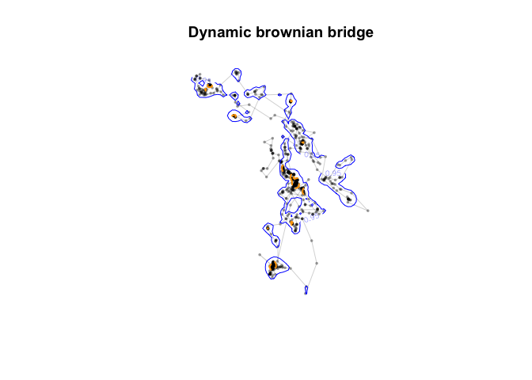

Additional LoCoh & BB code
================

Here are some additional notes and code for about Local Covenx Hull and Brownian Bridge methods for home range analysis in the `move` and `adehabitatHR` packages.

``` r
library(move)
library(adehabitatHR)
library(sp)

data(bear) # load the data
xy <- SpatialPoints(na.omit(ld(bear)[,1:2])) #transform the ltraj to dataframe, remove nas, make spatial points. 
```

Brownian Bridge Methods
=======================

Kernel BB
---------

``` r
#sig1   
#first smoothing parameter for the brownian bridge method (related to the speed of the animals; it can be estimated by the function liker).
#sig2   
#second smoothing parameter for the brownian bridge method (related to the imprecision of the relocations, supposed known).

# estimate sig1
liker(bear, sig2 = 30, rangesig1 = c(1, 10))
```


    ## *****************************************
    ## 
    ## Maximization of the log-likelihood for parameter
    ## sig1 of brownian bridge
    ## 
    ## W0208 : Sig1 = 3.3153 Sig2 = 30

``` r
kud <- kernelbb(bear, sig1 = 3.3153, sig2 = 30)
image(kud) + title("Bear bb_UD")
```


    ## integer(0)

``` r
## Kernel home range
jj <- kernel.area(kud)                  ## home range size
jj
```

    ##        20        25        30        35        40        45        50 
    ##   0.00000  22.75045  22.75045  45.50091  45.50091  68.25136  68.25136 
    ##        55        60        65        70        75        80        85 
    ##  91.00182 113.75227 136.50272 159.25318 204.75409 273.00545 386.75772 
    ##        90        95 
    ## 568.76135 887.26770

``` r
ver95 <- getverticeshr(kud) ## home-range contours
ver80  <- getverticeshr(kud, percent = 80)
plot(ver95)  + plot(ver80, add=TRUE, col="green")  +  points(xy)   ## Plots contours
```


    ## integer(0)

Dynamic Brownian Bridge UD
--------------------------

``` r
library(move)
bear_move <- move(x=bear[[1]]$x, y=bear[[1]]$y, time=bear[[1]]$date, proj="+init=epsg:3857")
```

    ## Warning in .local(x, y, time, data, proj, ...): There were NA locations
    ## detected and omitted. Currently they are not stored in unusedrecords

``` r
BB.bear <- brownian.bridge.dyn(bear_move, 
                                dimSize=150, 
                                location.error=30,  #can also provide vector with changing positional errors
                                margin=21,
                                ext=.5,
                                window.size=99, 
                                time.step=2) 
```

    ## Computational size: 2.6e+08

``` r
udbear <- getVolumeUD(BB.bear)

plot(bear_move, col="#00000060", pch=16, cex=0.5,
     bty="n", xaxt="n", yaxt="n", xlab=NA, ylab=NA) +
lines(bear_move, col="#00000030") +
# add isopleths
contour(udbear, levels=c(0.5, 0.95), add=TRUE, lwd=c(2, 1), lty=c(2,1), col = c("orange", "blue"))+
  title("Dynamic brownian bridge")
```



    ## integer(0)

Much much much tighter contours than kUD and MCP methods!

Local-Convex-Hull Methods
-------------------------

From the adehabitatLT vignette:

> The LoCoH (Local Convex Hulls) family of methods has been proposed by Getz et al. (2007) for locating Utilization Distributions from relocation data. Three possible algorithms can be used: Fixed k LoCoH, Fixed r LoCoH, and Adaptive LoCoH. The three algorithms are implemented in adehabitatHR. All the algorithms work by constructing a small convex hull for each relocation and its neighbours, and then incrementally merging the hulls together from smallest to largest into isopleths. The 10% isopleth contains 10% of the points and represents a higher utilization than the 100% isopleth that contains all the points (as for the single linkage method). The three methods are as follows: (1) Fixed k LoCoH: Also known as k-NNCH, Fixed k LoCoH is described in Getz and Willmers (2004). The convex hull for each point is constructed from the (k-1) nearest neighbors to that point. Hulls are merged together from smallest to largest based on the area of the hull. This method is implemented in the function `LoCoH.k` (2) Fixed r LoCoH: In this case, hulls are created from all points within r distance of the root point. When merging hulls, the hulls are primarily sorted by the value of k generated for each hull (the number of points contained in the hull), and secondly by the area of the hull. This method is implemented in the function `LoCoH.r` (3) Adaptive LoCoH: Here, hulls are created out of the maximum nearest neighbors such that the sum of the distances from the nearest neighbors is less than or equal to d. Use the same hull sorting as Fixed r LoCoH. This method is implemented in the function `LoCoH.a`
