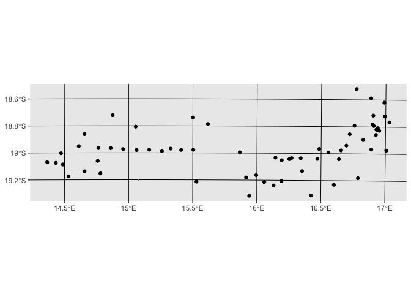
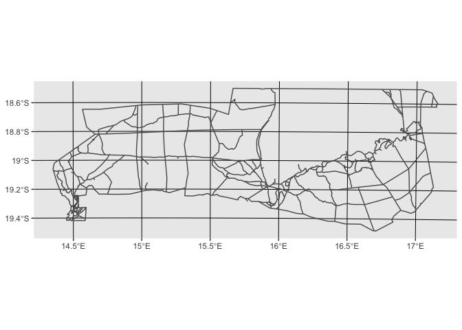
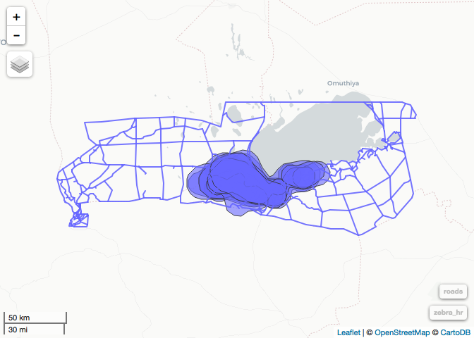
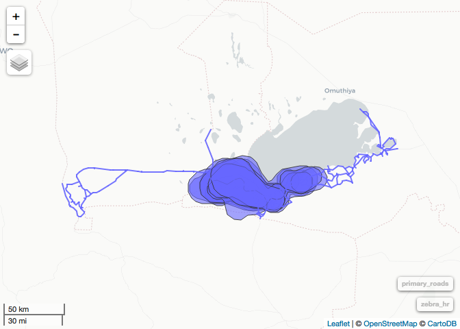
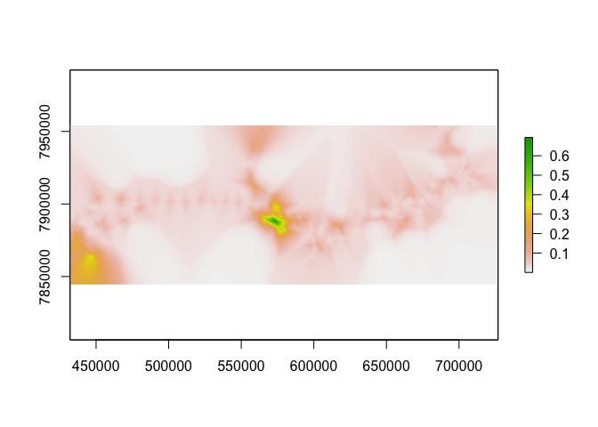

Day 5 - Prepaing a a basic RSF
================
Dana Seidel & Eric Dougherty
January 5, 2018

``` r
#install.packages("lme4")
library(raster)
library(lme4)
library(sf)
library(tidyverse)
library(adehabitatHR)
library(mapview)
```

Building a RSF
==============

For another, more thourough example of building an RSF in R, see the Manual of Applied Spatial Ecology, Chapter 8, Resource Selection. <http://ecosystems.psu.edu/research/labs/walter-lab/manual/chapter-8-resource-selection>

Step 1: Read in, Clean, and project all your Data
-------------------------------------------------

``` r
zebra <- read_csv("data_files/Zebra_Used_LatLong_Full.csv") %>% 
  dplyr::select(ID = Name, 4:6) %>% 
  st_as_sf(., coords = 3:4, crs = "+init=epsg:4326") %>% 
  st_transform("+init=epsg:32733") %>% 
  mutate(timestamp = lubridate::mdy_hm(Date))
```

    ## Warning: Missing column names filled in: 'X1' [1]

    ## Parsed with column specification:
    ## cols(
    ##   X1 = col_integer(),
    ##   X = col_integer(),
    ##   Name = col_character(),
    ##   Date = col_character(),
    ##   Longitude = col_double(),
    ##   Latitude = col_double(),
    ##   Speed = col_double(),
    ##   Direction = col_integer(),
    ##   Temp = col_double(),
    ##   Altitude = col_integer(),
    ##   PDOP = col_integer(),
    ##   ID = col_character(),
    ##   DatePOS = col_datetime(format = ""),
    ##   diff = col_integer(),
    ##   day = col_date(format = "")
    ## )

``` r
water <- st_read("data_files/ENP shapefiles/functional water.shp") %>% 
  st_transform("+init=epsg:32733")
```

    ## Reading layer `functional water' from data source `/Users/dseidel/Desktop/HongKong/Materials/Day5/data_files/ENP shapefiles/functional water.shp' using driver `ESRI Shapefile'
    ## Simple feature collection with 63 features and 12 fields
    ## geometry type:  POINT
    ## dimension:      XY
    ## bbox:           xmin: 433203.2 ymin: 7863998 xmax: 713926.9 ymax: 7951373
    ## epsg (SRID):    32733
    ## proj4string:    +proj=utm +zone=33 +south +datum=WGS84 +units=m +no_defs

``` r
ggplot(water) + geom_sf()
```



``` r
roads <- st_read("data_files/ENP shapefiles/enp roads.shp", crs = "+init=epsg:4326") %>% 
  st_transform("+init=epsg:32733")
```

    ## Reading layer `enp roads' from data source `/Users/dseidel/Desktop/HongKong/Materials/Day5/data_files/ENP shapefiles/enp roads.shp' using driver `ESRI Shapefile'
    ## Simple feature collection with 565 features and 3 fields
    ## geometry type:  LINESTRING
    ## dimension:      XY
    ## bbox:           xmin: 14.35337 ymin: -19.48418 xmax: 17.15124 ymax: -18.5008
    ## epsg (SRID):    4326
    ## proj4string:    +proj=longlat +datum=WGS84 +no_defs

``` r
ggplot(roads) + geom_sf()
```



``` r
NDVI <- raster("data_files/NDVI_200903.tif") %>% 
  projectRaster(crs="+proj=utm +zone=33 +south +datum=WGS84 +units=m +no_defs +ellps=WGS84 +towgs84=0,0,0")
```

### Keep in mind temporal effects!

RSF may be a spatial analysis but if we think selection or availability may change over time, we must control for that in our models, either via appropriate covariate inclusion, or simpky by limiting our scope.

``` r
# NDVI was collected in March 2009... perhaps we should limit to only the rainy season months. 
# Jan, Feb, Mar

zebra %>% 
  filter(lubridate::month(timestamp) %in% 1:3) %>% 
  sf::select.sf(-Date) %>% 
  mutate(Used = 1) -> zebra
```

Preparing Used v. Available
---------------------------

``` r
# Choosing an available range. 
# semiconservative option - 99% UD
#zebra_ud <- adehabitatHR::kernelUD(as(zebra, "Spatial"), 
#                                   grid = 450)
zebra_ud <- adehabitatHR::kernelUD(as(zebra, "Spatial")[1],  # add the id column and you get unique homeranges
                                   grid = 450)
zebra_hr <- adehabitatHR::getverticeshr(zebra_ud, 99)

# let's visualize to see
homerange <- mapview(zebra_hr)
homerange
```


``` r
# Note a couple things here: 
# - the pan: is this really available?
# - the park fence?
# we could mask by these polygons."expert opinion"

# For now we are going to use these to sample available points. 
# First I need to know how many points to sample in each home range. 

zebra_ids <- unique(zebra$ID)
availables <- list()
for(i in 1:length(zebra_ids)){
  st_sample(st_as_sf(zebra_hr)[i,], 10*nrow(filter(zebra, ID == zebra_ids[i]))) %>% # sample individual UDs
  #st_sample(st_as_sf(zebra_hr), 10*nrow(filter(zebra, ID == zebra_ids[i])))  %>%  # 1:10 ratio; population UD
  st_sf(geometry = .) %>%
    mutate(ID = zebra_ids[i], 
          timestamp = NA, 
          Used = 0) -> availables[[i]] 
}

availables %>% 
  do.call(rbind,.) %>%
  rbind(zebra, .) -> zebra_all
```

Preparing linear measures
=========================

``` r
head(roads)
```

    ## Simple feature collection with 6 features and 3 fields
    ## geometry type:  LINESTRING
    ## dimension:      XY
    ## bbox:           xmin: 444189.2 ymin: 7852892 xmax: 456895.4 ymax: 7862522
    ## epsg (SRID):    32733
    ## proj4string:    +proj=utm +zone=33 +south +datum=WGS84 +units=m +no_defs
    ##     TYPE LENGTH KM                       geometry
    ## 1  Track    0.7  1 LINESTRING (448015.32650224...
    ## 2  Track    3.6  4 LINESTRING (446520.91553615...
    ## 3 Graded    2.3  2 LINESTRING (446079.07906790...
    ## 4  Track    7.1  7 LINESTRING (456408.40260323...
    ## 5  Track    1.2  1 LINESTRING (456408.40260323...
    ## 6 Graded    0.1  0 LINESTRING (450207.57207346...

``` r
unique(roads$TYPE)
```

    ## [1] Track  Graded Gravel Tar   
    ## Levels: Graded Gravel Tar Track

``` r
mapview(roads, homerange)
```



``` r
primary_roads <- filter(roads, TYPE %in% c("Tar", "Gravel"))
mapview(primary_roads, homerange)
```



``` r
# next step take 20 sec or so
dist<- st_distance(y=zebra_all, x=primary_roads) # a units matrix dim =[nrow(x), nrow(y)]
road_dist <- apply(dist, 2, min)
head(road_dist)
```

    ## [1]  67.55652  83.57967 600.20323 101.35086 742.50928 253.19827

``` r
#
dist<- st_distance(y=zebra_all, x=water) # a units matrix dim =[nrow(x), nrow(y)]
water_dist <- apply(dist, 2, min)
head(water_dist)
```

    ## [1] 2123.537 2159.074 2626.885 2151.926 4992.191 4475.806

Preparing raster covariates
===========================

``` r
zebra_all %>% mutate(NDVI = raster::extract(NDVI, as(., "Spatial")), 
                     dist_rd = road_dist,
                     dist_H2O = water_dist) %>% 
  group_by(ID) -> zebra_full
```

Building the RSF
================

Approaches
----------

From Spatial Ecology &gt; There are several ways to to calculate RSFs in R using logistic functions that can assess population level or intra-population variation. The use of General Linear Models with various function using the `lme4` package is often used for estimating population-level models only. Alternatively, we can assess intra-population variation using the `glmer` function. Assessing intra-population variation is a mixed-model approach that provides a powerful and flexible tool for the analysis of balanced and unbalanced grouped data that are often common in wildlife studies that have correlation between observations within the same group or variation among individuals at the same site (Gillies et al. 2006).

### A note on colinearity

<http://blog.minitab.com/blog/understanding-statistics/handling-multicollinearity-in-regression-analysis>

When preparing for a regression analysis we want to ensure that our covariates are not overly correlated. If two variables are highly correlated with one another it makes it hard to distinguish their individual effects on the response variable - in this case, the use of a habitat type.

Thankfully for us, productivity and distance to road and water do not seem to be especially correlated in our system:

``` r
cor(zebra_full$NDVI, zebra_full$dist_rd)
```

    ## [1] -0.05600764

``` r
cor(zebra_full$NDVI, zebra_full$dist_H2O)
```

    ## [1] 0.09155611

People debate how to deal with multicollinearity but a standard rule of sum is to to drop variables that have a correlation coeffienct of over .7.

### Population Level - glm

``` r
m <- glm(Used ~ NDVI + dist_rd + dist_H2O, data=zebra_full, family=binomial(link="logit"))

stepAIC(m)
```

    ## Start:  AIC=14122.17
    ## Used ~ NDVI + dist_rd + dist_H2O
    ## 
    ##            Df Deviance   AIC
    ## - NDVI      1    14115 14121
    ## <none>           14114 14122
    ## - dist_rd   1    14604 14610
    ## - dist_H2O  1    15295 15301
    ## 
    ## Step:  AIC=14120.83
    ## Used ~ dist_rd + dist_H2O
    ## 
    ##            Df Deviance   AIC
    ## <none>           14115 14121
    ## - dist_rd   1    14604 14608
    ## - dist_H2O  1    15300 15304

    ## 
    ## Call:  glm(formula = Used ~ dist_rd + dist_H2O, family = binomial(link = "logit"), 
    ##     data = zebra_full)
    ## 
    ## Coefficients:
    ## (Intercept)      dist_rd     dist_H2O  
    ##  -3.4102893   -0.0001611    0.0001425  
    ## 
    ## Degrees of Freedom: 25299 Total (i.e. Null);  25297 Residual
    ## Null Deviance:       15490 
    ## Residual Deviance: 14110     AIC: 14120

##### A Note on Procedure:

Clearly this is a simplified example for trainings sake. Typically in a full RSF analysis you would evaluate multiple candidate models and use model selection and averaging procedures to choose the one best supported by your data. Additionally one would expect to use some cross validation procedure to evaluate the predictive ability of your best model.

### Account for individual variation - glmer

``` r
zebra_full$ID <- as_factor(zebra_full$ID)

mm <- glmer(Used ~ scale(dist_rd) + scale(dist_H2O) + (1|ID), 
           data=zebra_full, family=binomial(link="logit"))

mm
```

    ## Generalized linear mixed model fit by maximum likelihood (Laplace
    ##   Approximation) [glmerMod]
    ##  Family: binomial  ( logit )
    ## Formula: Used ~ scale(dist_rd) + scale(dist_H2O) + (1 | ID)
    ##    Data: zebra_full
    ##       AIC       BIC    logLik  deviance  df.resid 
    ## 14094.011 14126.565 -7043.006 14086.011     25296 
    ## Random effects:
    ##  Groups Name        Std.Dev.
    ##  ID     (Intercept) 0.1697  
    ## Number of obs: 25300, groups:  ID, 8
    ## Fixed Effects:
    ##     (Intercept)   scale(dist_rd)  scale(dist_H2O)  
    ##         -2.5944          -0.5868           0.7979

Predicting from an RSF
======================

Often we want to interpolate a selection surface from our best model. To do this you must ensure first that you have complete data layers across you entire area of interest. Since our NDVI layer covers our entire zone we need not recreate that, but for our roads and water variables we need to create layers for distance to roads or distance to water across our entire regions. We are going to show you below how to calculate this in the below chunk but as this takes a long time to process, we will pull in pre-calculated geotiff in the next chunk for further mapping.

``` r
# bring in boundary of area of interest
ENP <- st_read("data_files/ENP shapefiles/enp fence poly.shp") %>% 
  st_union %>% st_transform("+init=epsg:32733")

# Let's match the resolution of our NDVI layer
# res(NDVI)

# make a grid and calculate distances
enp_grid <- st_make_grid(ENP, n = c(1266, 476), what= "centers") 
# convert to raster
dist_raster <- raster(as(enp_grid, "Spatial"), ncol=1266, nrow= 476)

# dist_road_grid <- st_distance(primary_roads, enp_grid)
dist_water_grid <- st_distance(water, enp_grid)
# dist_raster[] = apply(dist_road_grid, 2, min)
dist_raster[] = apply(dist_water_grid, 2, min)


plot(dist_raster)
plot(st_geometry(water), add=TRUE)

# alternative method using sp and regos libraries -- comparable, doesn't require flip
#require(rgeos)
#dd = gDistance(as(water, "Spatial"), as(dist_raster,"SpatialPoints"), byid=TRUE)
#dist_raster[] = apply(dd,1,min)
```

To do the above for both the water and road layers would take 5-10 mins, so instead let's read in the final rasters for processing:

``` r
dist_road <- raster("data_files/Dist_PrimaryRoads.tif") %>% flip(2)
dist_water <- raster("data_files/Dist_Water.tif") %>% flip(2)

# why are we using flip?
# these files were created with st_distance function. gDistance would not require this. 
# http://rspatial.org/spatial/rst/8-rastermanip.html
# "flip lets you flip the data (reverse order) in horizontal or vertical direction – typically to correct for a ‘communication problem’ between different R packages or a misinterpreted file."
# sf and raster have a "communication problem", in the way the distance is calculated in st_distance. 


# make a dataframe of all variable points:
# step 1 make ndvi points match in space to the dist variables
ndvi <- resample(crop(NDVI, extent(dist_road)), dist_road)
# stack them all
rasters <- stack(ndvi, dist_road, dist_water)
names(rasters) <- c("NDVI", "dist_rd", "dist_H2O")

#predictions based on best model
best_m <- glm(Used ~ dist_rd + dist_H2O, data=zebra_full, family=binomial(link="logit"))

# make a predicted raster layer based upon glm
predictions = raster::predict(object = rasters, model=m, fun=predict)
predictions = exp(predictions)

plot(predictions)
```


