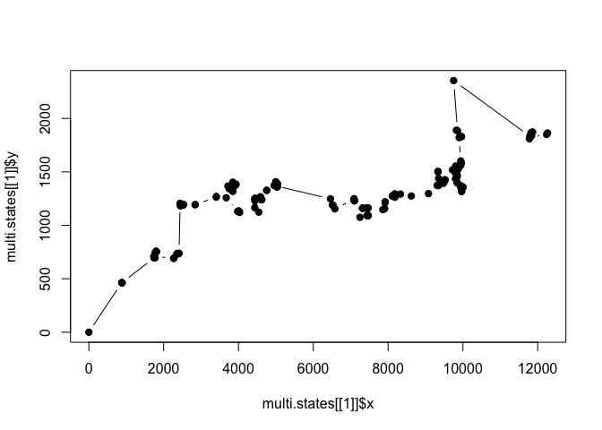
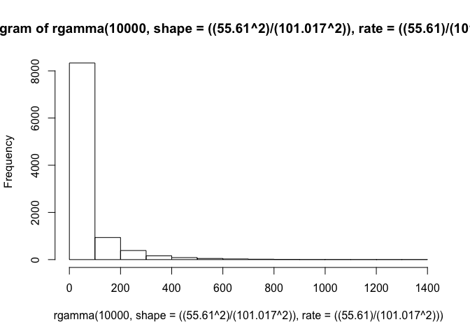
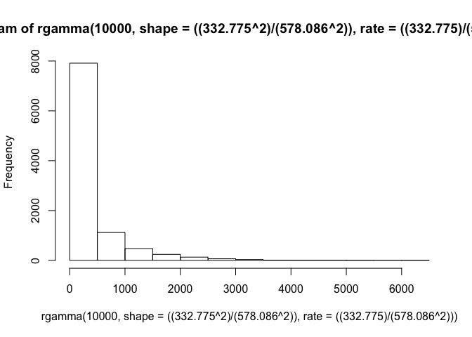
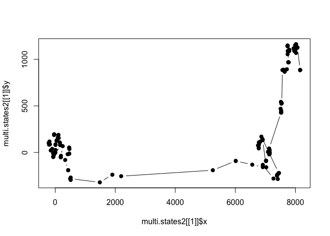
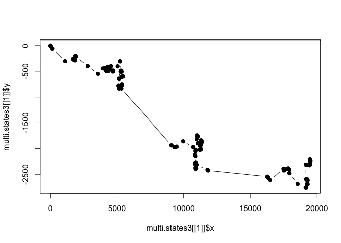

Simulating\_Movement\_part2
================

I think you've seen some of the flexibility of functions. Before we move on with this session, we're going to reload that `movement` function.

``` r
movement <- function(xy, step, heading) {
  
  #First we need to define pi
  pi = 3.141593
  
  #Then we split the starting point into an x_init and y_init
  x_init <- xy[1,1]
  y_init <- xy[1,2]
  
  #Here we translate the negative pi values into positive values
  #The headings now range from 0 to 2*pi
  if (heading < 0) {
    heading <- abs(heading) + pi
  }
  
  #Using this heading, and our sin function, we can solve for the change in y
  #Then we want to create a new value where we alter the starting y value
  y_change <- sin(heading)*step
  y_new <- y_init + y_change
  
  #The use cosine to determine the movement in x direction
  x_change <- cos(heading)*step
  x_new <- x_init + x_change

  #Finally, we create a data frame and save our new coordinates
  move.temp <- as.data.frame(matrix(0,1,4))
  move.temp[1,1] <- x_new
  move.temp[1,2] <- y_new
  move.temp[1,3] <- step
  move.temp[1,4] <- heading
  
  return(move.temp)
}
```

That's a pretty simple movement function with a few basic user inputs, but we may want to complicate things a bit more in order to make our function reflect real movement patterns more closely. We spent a lot of time talking about behavioral state analysis, so maybe we can implement some of these concepts in a new function.

This function is going to act similarly to the first, but instead of drawing all of the steps and angles randomly from the same normal or uniform distribution, we are going to have two separate distributions for the two different behavioral states, which we will think of as foraging and directional travel. We can get the parameters defining these distributions from the outputs of our HMM analysis. If you remember our two-state zebra model (`z`), we ended up with estimates that looked like this:

| Parameter            | State 1 | State 2 |
|----------------------|---------|---------|
| Mean Step Length (m) | 55.610  | 332.775 |
| SD Step Length (m)   | 101.017 | 578.086 |

| Parameter                | State 1 | State 2 |
|--------------------------|---------|---------|
| Mean Turning Angle (rad) | -0.096  | -0.030  |
| Mean Concentration       | -0.254  | 19.656  |

This gives us a really good idea of how to parameterize steps and turning angles that more accurately reflect zebra movement, but we'll need to create some framework whereby we select which behavioral state the animal is in before we assign certain step lengths and turning angles. We also used the HMM we built to determine the probability of being in each of the three states (as well as more complex functions to determine the probability of transitioning between states). Lets try that now using our `multi.move` function as a starting point:

``` r
library(CircStats)
```

    ## Loading required package: MASS

    ## Loading required package: boot

``` r
multi.state <- function(N, x) {
  all.paths <- list()
  
  for (j in 1:N) {
    steps.df <- data.frame(matrix(0,100,5))
    colnames(steps.df) <- c("x", "y", "step.length", "turn.angle", "behav.state")

    for (i in 2:x[j]) {
      rand <- runif(1,0,1) #select the behavioral state for this step
      if (rand < 0.812) { #probability of state 1
        step <- rgamma(n=1, shape=((55.610^2)/(101.017^2)), rate=((55.610)/(101.017^2)))
        heading <- rvm(n=1, mean=-0.096, k=0.254)
        behave.state <- 1
      } else { #probability of state 2
        step <- rgamma(n=1, shape=((332.775^2)/(578.086^2)), rate=((332.775)/(578.086^2)))
        heading <- rvm(n=1, mean=-0.030, k=19.656)
        behave.state <- 2
      }
      
      next.pt <- movement(steps.df[(i-1),1:2], step, heading)
      steps.df[i,1:4] <- next.pt
      steps.df[i,5] <- behave.state
      
    }
    
    all.paths[[j]] <- steps.df
  }
  return(all.paths)
}
```

Let's run our new function and see how a path of 200 points looks:

``` r
multi.states <- multi.state(1, c(200))
dim(multi.states[[1]])
```

    ## [1] 200   5

``` r
plot(multi.states[[1]]$x, multi.states[[1]]$y, pch=19, type='b')
```



Now you'll notice that these paths cover a smaller area than when we used the normal distribution with a mean of 500 and an SD of 100 even though we transformed the values from kilometers to meters. We can take a look at what the gamma distributions of the steps from our different beahvioral states look like to illustrate the relative magnitude of the steps we're defining now:

``` r
hist(rgamma(10000, shape=((55.610^2)/(101.017^2)), rate=((55.610)/(101.017^2))))
```



``` r
hist(rgamma(10000, shape=((332.775^2)/(578.086^2)), rate=((332.775)/(578.086^2))))
```



It is not especailly surprising that, even over twice as long of a path, our animal doesn't cover quite as much space. Our longest steps (which are the only ones that are at the same order of magnitude as our previous normal distribution) only occur about one-fifth of the time. The other ~80% of points are much smaller step sizes. But, but incorporating these behavioral states, we have simulated a much more realistic trajectory than what we had with our arbitrary distributions earlier.

Now, if you really want a challenge, we could redesign our `multi.state` function such that an initial behavioral state is assigned at the first step, and the animal transitions between states according to the functions we extracted during the HMM analysis. In order to do this, we are going to have to keep track of the time too, because these transition probability functions were based on a temporal covariate. You may remember that the zebra data were collected at a fix rate of 20 minutes, meaning that we will have sets of three points all with the same temporal covariate value (i.e., 3:00, 3:20, and 3:40 will all be given a value of 3). You should also note that the regression coefficient values given in the HMM output should be treated as values in a logistic regression, meaning that they should be used in the form: exp(intercept + (slope \* Time)). Also, you'll probably want to use the `base::rbinom` command to determine whether the behavioral state will shift based on the resulting probabilities.

``` r
multi.state2 <- function(N, x) {
  all.paths <- list()
  
  for (j in 1:N) {
    steps.df <- data.frame(matrix(0,100,5))
    colnames(steps.df) <- c("x", "y", "step.length", "turn.angle", "behav.state")
    
    rand <- runif(1,0,1)
    if (rand < 0.812) {
      prev.state <- 1
    } else {
      prev.state <- 2
    }
    steps.df[1,5] <- prev.state

    for (i in 2:x[j]) {
      time <- i %/% 3
      if (time > 23) {
        days <- i %/% 72
        time <- time - (24 * days)
      }
      
      if (prev.state == 1) {
        prob.1to2 <- exp(-2.564 + (-0.034 * time))
        if (prob.1to2 > 0 && prob.1to2 < 1) {
          trans.1to2 <- rbinom(1,1,prob.1to2)
        } else {
          trans.1to2 <- 0
        }
        if (trans.1to2 == 1) {
          behave.state <- 2
        } else {
          behave.state <- 1
        }
      } else {
        prob.2to1 <- exp(-1.544 + (0.016 * time))
        if (prob.2to1 > 0 && prob.2to1 < 1) {
          trans.2to1 <- rbinom(1,1,prob.2to1)
        } else {
          trans.2to1 <- 0
        }
        if (trans.2to1 == 1) {
          behave.state <- 1
        } else {
          behave.state <- 2
        }
      } 
      
      if (behave.state == 1) { #probability of state 1
        step <- rgamma(n=1, shape=((55.610^2)/(101.017^2)), rate=((55.610)/(101.017^2)))
        heading <- rvm(n=1, mean=-0.096, k=0.254)
      } else { #probability of state 2
        step <- rgamma(n=1, shape=((332.775^2)/(578.086^2)), rate=((332.775)/(578.086^2)))
        heading <- rvm(n=1, mean=-0.030, k=19.656)
      } 
      
      next.pt <- movement(steps.df[(i-1),1:2], step, heading)
      steps.df[i,1:4] <- next.pt
      steps.df[i,5] <- behave.state
      
      prev.state <- behave.state
    }
    
    all.paths[[j]] <- steps.df
  }
  return(all.paths)
}
```

This is a pretty serious challenge, and it should be noted that my way is not the only (nor necessarily the most efficient) way to create a working function. Before I pat myself on the back too much, lets make sure this works and then we'll go through the process that I coded up.

``` r
multi.states2 <- multi.state2(1, c(200))
plot(multi.states2[[1]]$x, multi.states2[[1]]$y, pch=19, type='b')
```



Alright, it appears to do what we want it to do! So the first thing I did was come up with a way of calculating what time it was (assuming that the simulation began at hour 0) at the start of each step. The `%/%` operator is a helpful tool for dividing two values and eliminating the remainder (i.e., rounding down to the nearest whole value). Because the time in our HMM was only integer value ranging from 0 to 23, this was the best way to transform our 20 minute fixes into hourly values. The next complication was the fact that 200 points would result in values greater than 23, at which point we wanted the counter to reset to 0. I used a day counter which only kicked in after the time value went over 23, and it would calculate the number of days after that point and we could subtract 24\*days from the time.

The next challenge was to set the initial state for the individual, but this was pretty easy because we could just steal the same concept from above. We choose a random number between 0 and 1 and if that value falls within the proportion associated with a particular state, the animal was assigned to that `prev.state`. Now we start going through each of the time steps, and with each one, we want to evaluate whether the individual is going to remain in their present state or transition based on the equations we extracted using the HMM. This involves a few little workarounds because there are a few errors we may run into. The basic idea is to use the regression coefficients to obtain a probability, then use that probability to drive a random draw from a binomial distribution (which provides either a 0 or a 1). We may run into some issues though, because the `rbinom` command will only accept probabilities between 0 and 1 (which makes sense, but isnt necessarily the case for every hour one could input into the equations we obtain from the HMM). To circumvent these errors, we can use `if` statements that make the loop progress even if we may have otherwise hit an error. There are a few nested `if` statements here:

-   1.  at the highest level, we use an `if` statement to check whether the prev.state of the individual is a 1 or 2; then, we calculate the transition probability from the prev.state to the other state at this particular time of day

-   1.  next, we check `if` this probability falls between 0 and 1, and we run a binomial draw to see whether the individual actually transitions; `if` the probability for the transition is not between 0 and 1, we set the transition value to 0 and maintain the current state

-   1.  finally, `if` the binomial draw results in a 1, the individual transitions into the appropriate state

Once all those checks are completed, we can finally assign the correct step length and turning angle given the current behavioral state. I also make one last change which results in another column that displays the current state for each step.

``` r
table(multi.states2[[1]]$behav.state)
```

    ## 
    ##   1   2 
    ## 184  16

Look at that! The result is a distribution of steps that aligns very nicely with the empirical track (i.e., approximately 80% of the points fall into behavioral state 1 and about 20% in behavioral state 2). This is a nice verification that our model is working as we intend.

You'll notice that we directly inputed all of the values for the step lengths and turning angles as well as the transition probability functions. If we wanted to make it more user-friendly and adaptable, we could make those things user-defined inputs instead of hard coding them. That is a reasonable next step and we'll consider it your final challenge of the activity. I would create a `multi.state.user` functions that requires that the user to input three things: a matrix (or vector) of steps means and SD, a matrix (or vector) of turning angle means and concentrations, and a matrix (or vector) of the intercepts and coefficients of the transitions:

``` r
multi.state.user <- function(N, x, step.params, angle.params, trans.probs) {
  all.paths <- list()
  
  for (j in 1:N) {
    steps.df <- data.frame(matrix(0,100,5))
    colnames(steps.df) <- c("x", "y", "step.length", "turn.angle", "behav.state")
    
    rand <- runif(1,0,1)
    if (rand < 0.812) {
      prev.state <- 1
    } else {
      prev.state <- 2
    }
    steps.df[1,5] <- prev.state

    for (i in 2:x[j]) {
      time <- i %/% 3
      if (time > 23) {
        days <- i %/% 72
        time <- time - (24 * days)
      }
      
      if (prev.state == 1) {
        prob.1to2 <- exp(trans.probs[1,1] + (trans.probs[2,1] * time))
        if (prob.1to2 > 0 && prob.1to2 < 1) {
          trans.1to2 <- rbinom(1,1,prob.1to2)
        } else {
          trans.1to2 <- 0
        }
        if (trans.1to2 == 1) {
          behave.state <- 2
        } else {
          behave.state <- 1
        }
      } else {
        prob.2to1 <- exp(trans.probs[1,2] + (trans.probs[2,2] * time))
        if (prob.2to1 > 0 && prob.2to1 < 1) {
          trans.2to1 <- rbinom(1,1,prob.2to1)
        } else {
          trans.2to1 <- 0
        }
        if (trans.2to1 == 1) {
          behave.state <- 1
        } else {
          behave.state <- 2
        }
      } 
      
      if (behave.state == 1) { #probability of state 1
        step <- rgamma(n=1, shape=((step.params[1,1]^2)/(step.params[2,1]^2)), rate=((step.params[1,1])/(step.params[2,1]^2)))
        heading <- rvm(n=1, mean=angle.params[1,1], k=angle.params[2,1])
      } else { #probability of state 2
        step <- rgamma(n=1, shape=((step.params[1,2]^2)/(step.params[2,2]^2)), rate=(step.params[1,2]/(step.params[2,2]^2)))
        heading <- rvm(n=1, mean=angle.params[1,2], k=angle.params[2,2])
      } 
      
      next.pt <- movement(steps.df[(i-1),1:2], step, heading)
      steps.df[i,1:4] <- next.pt
      steps.df[i,5] <- behave.state
      
      prev.state <- behave.state
    }
    
    all.paths[[j]] <- steps.df
  }
  return(all.paths)
}
```

Let's run it with the same inputs that we previously hard-coded and see if we get similar results (it wont be exactly the same because it's still depending on a stochastic process):

``` r
step.in <- matrix(c(55.610, 101.017, 332.775, 578.086), ncol=2)
angle.in <- matrix(c(-0.096, 0.254, -0.030, 19.656), ncol=2)
trans.in <- matrix(c(-2.564, -0.034, -1.544, 0.016), ncol=2)

multi.states3 <- multi.state.user(1, c(200), step.in, angle.in, trans.in)
plot(multi.states3[[1]]$x, multi.states3[[1]]$y, pch=19, type='b')
```



``` r
table(multi.states3[[1]]$behav.state)
```

    ## 
    ##   1   2 
    ## 145  55

It appears to be working! Now you can change some of the input values and see what kind of effect it has on the results.
